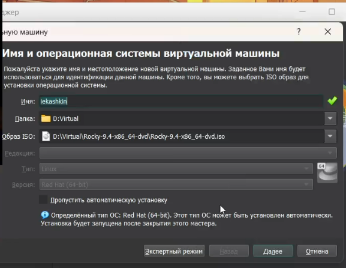
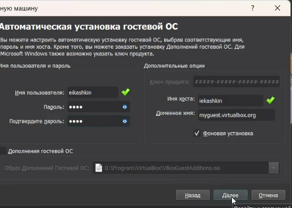
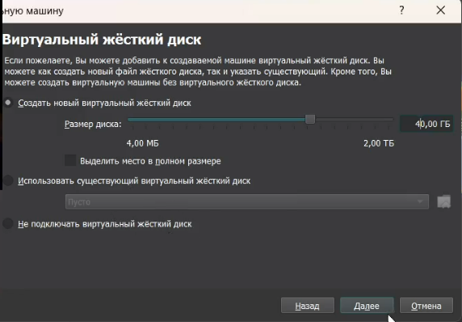
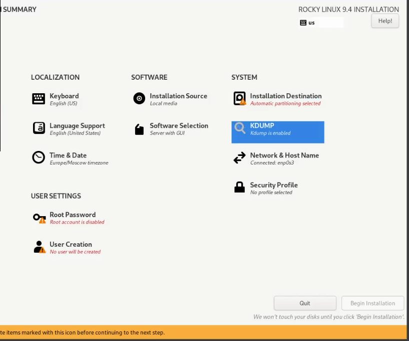
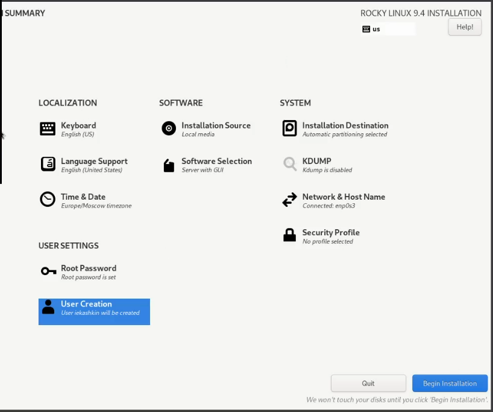
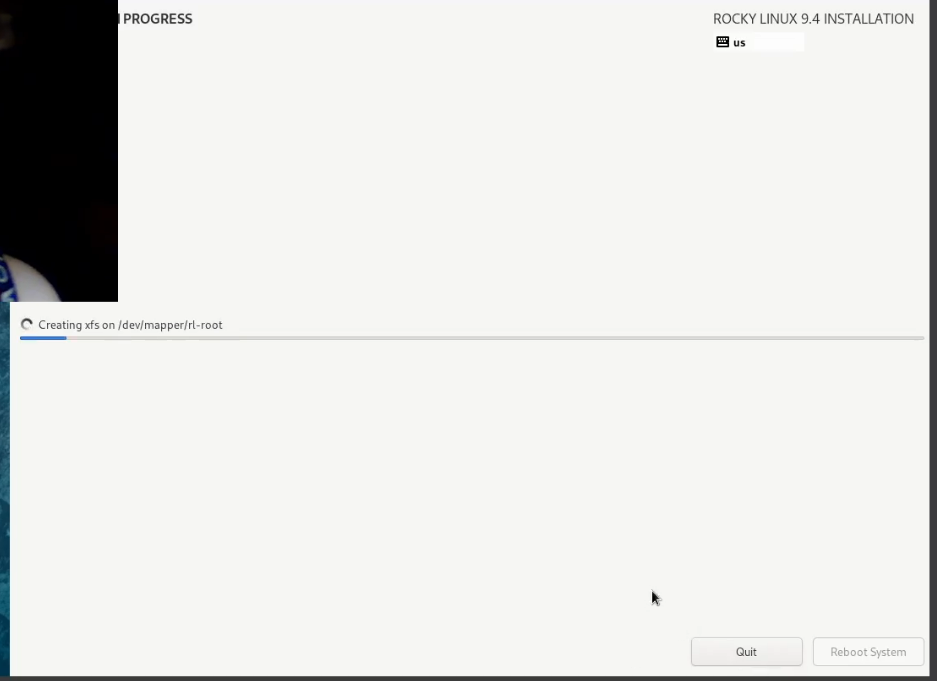
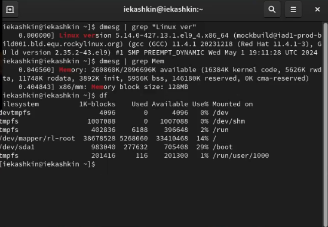

---
# Front matter
lang: ru-RU
title: "Отчёт по лабораторной работе №1"
subtitle: "Установка ОС на виртуальную машину"
author: "Кашкин Иван НБИ-01-21"

# Formatting
toc-title: "Содержание"
toc: true # Table of contents
toc_depth: 2
lof: true # List of figures
fontsize: 12pt
linestretch: 1.5
papersize: a4paper
documentclass: scrreprt
polyglossia-lang: russian
polyglossia-otherlangs: english
mainfont: PT Serif
romanfont: PT Serif
sansfont: PT Sans
monofont: PT Mono
mainfontoptions: Ligatures=TeX
romanfontoptions: Ligatures=TeX
sansfontoptions: Ligatures=TeX,Scale=MatchLowercase
monofontoptions: Scale=MatchLowercase
indent: true
pdf-engine: lualatex
---

# Цель работы 

Целью раюоты является приобретение практических навыков устоновки операционной системы на виртуальную машины.

1. Создаю виртуальную машину 

{ #fig:001 width=70% height=70% }

2. Создавал пользователя 

{ #fig:002 width=70% height=70% }

3. Настраивал размерность виртуального жесткого диска

{ #fig:003 width=70% height=70% }

4. Настройка основных параметров системы 

{ #fig:004 width=70% height=70% }

{ #fig:005 width=70% height=70% }

5. Ожидание установки системы 

{ #fig:006 width=70% height=70% }

6. Перезагрузка системы и проверка ее в терминале

{ #fig:007 width=70% height=70% }

# Вывод 

Мы приобрели практические навыки устоновки операционной системы на виртуальную машины.

1. Какую информацию содержит учётная запись пользователя?
Учётная запись пользователя в Linux содержит следующую информацию:

Имя пользователя (username): уникальный идентификатор пользователя в системе.
UID (User ID): числовой идентификатор пользователя, который используется системой для управления доступом и правами.
GID (Group ID): идентификатор основной группы пользователя.
Домашний каталог (home directory): путь к каталогу, который используется для хранения файлов и настроек пользователя.
Оболочка (shell): путь к командной оболочке, которая запускается при входе пользователя в систему.
Имя пользователя (Full name) и другая информация: дополнительная информация о пользователе, например, полное имя.
Эта информация обычно хранится в файле /etc/passwd.

2. Команды терминала
Для получения справки по команде:

man <команда> — например, man ls для получения справки о команде ls.
<команда> --help — например, ls --help.
Для перемещения по файловой системе:

cd <путь> — например, cd /home/user для перехода в каталог /home/user.
Для просмотра содержимого каталога:

ls — например, ls /home/user для отображения содержимого каталога /home/user.
ls -l — отображение подробной информации о файлах.
Для определения объёма каталога:

du -sh <путь> — например, du -sh /home/user для отображения общего объёма каталога /home/user.
Для создания / удаления каталогов / файлов:

Создание каталога: mkdir <путь> — например, mkdir /home/user/newdir.
Удаление каталога: rmdir <путь> (если пустой) или rm -r <путь> (если не пустой) — например, rmdir /home/user/olddir.
Создание файла: touch <файл> — например, touch /home/user/newfile.
Удаление файла: rm <файл> — например, rm /home/user/oldfile.
Для задания определённых прав на файл / каталог:

chmod <права> <файл> — например, chmod 755 /home/user/script.sh для установки прав на файл script.sh.
chown <владелец>:<группа> <файл> — например, chown user:group /home/user/file.
Для просмотра истории команд:

history — отображает список ранее выполненных команд.
Вы также можете использовать !<номер> для повторного выполнения команды из истории, например, !5.
3. Что такое файловая система? Приведите примеры с краткой характеристикой.
Файловая система — это способ организации и хранения данных на носителе (жестком диске, SSD и т.д.). Она управляет файлами и каталогами, определяет их расположение и доступ к ним.

Примеры:

ext4 (Fourth Extended Filesystem): используется в большинстве современных дистрибутивов Linux. Поддерживает большие объемы данных и файлов, имеет встроенную проверку целостности данных.
XFS: высокая производительность при работе с большими файлами и каталогами, поддерживает динамическое распределение дискового пространства.
Btrfs (B-tree File System): современная файловая система с поддержкой снимков (snapshots), сжатия и дедупликации данных.
4. Как посмотреть, какие файловые системы подмонтированы в ОС?
Для просмотра подмонтированных файловых систем можно использовать команду:

df -h — отображает информацию о всех смонтированных файловых системах с их использованием дискового пространства.
Также можно использовать команду:

mount — отображает список всех смонтированных файловых систем и их точки монтирования.
5. Как удалить зависший процесс?
Для удаления зависшего процесса можно использовать команду kill или killall:

Определите PID (Process ID) зависшего процесса с помощью команды ps или top.

ps aux | grep <имя процесса> — например, ps aux | grep firefox.
top — в реальном времени можно найти PID зависшего процесса.
Затем используйте команду kill для завершения процесса:

kill <PID> — например, kill 1234 для завершения процесса с PID 1234.
Если процесс не завершился после команды kill, используйте более принудительный метод:

kill -9 <PID> — например, kill -9 1234 для принудительного завершения процесса.
Можно использовать killall <имя процесса> для завершения всех процессов с указанным именем:

killall <имя процесса> — например, killall firefox.
