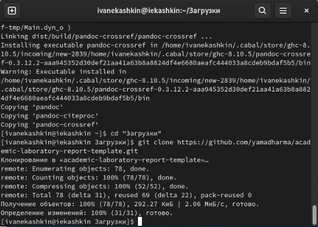
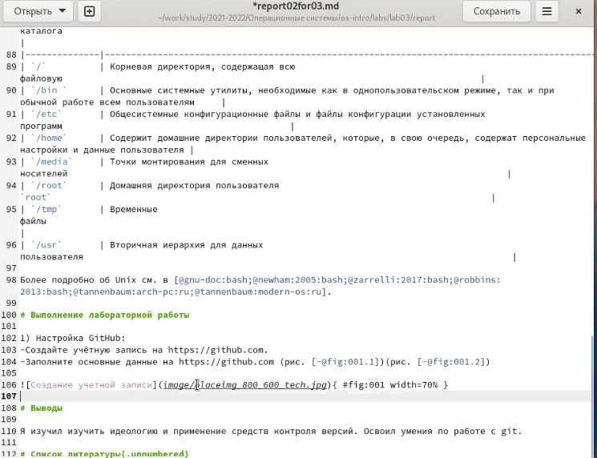
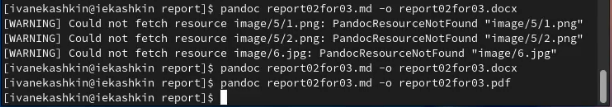

---
## Front matter
lang: ru-RU
title: Отчет по лабораторной работе №3
author: Кашкин Иван Евгеньевич
institute: РУДН, Москва, Россия
date: 28 апреля 2022 г.

## Formatting
toc: false
slide_level: 2
theme: metropolis
header-includes: 
 - \metroset{progressbar=frametitle,sectionpage=progressbar,numbering=fraction}
 - '\makeatletter'
 - '\beamer@ignorenonframefalse'
 - '\makeatother'
aspectratio: 43
section-titles: true
---

## Цель работы 

Научиться оформлять отчёты с помощью легковесного языка разметки Markdown.

## Задание

Сделайте отчёт по предыдущей лабораторной работе в формате Markdown. В качестве отчёта просьба предоставить отчёты в 3 форматах:pdf,docx и md (в архиве, поскольку он должен содержать скриншоты, Makefile и т.д.

## Клонирования шаблона 

-Для начала мы  кланировали из Github шаблон для написания отчета и после руками переместили его в нужную папку (рис. [-@fig:001])

{ #fig:001 width=70% }

## Заполняем шаблон для лабораторной №2

{ #fig:002 width=70% }

## Загрузка на Github

После заполнения всего отчета по 2 лабораторной работе в формате md, мы загружаем это на Github с помошью команд использованных в предыдущей работе (рис. [-@fig:004])

{ #fig:004 width=70% }

## Конвектирование

Далее по заданию мы конвектируем файл md в файлы docx и pdf (рис. [-@fig:006])

{ #fig:006 width=70% }

## Вывод

Научился оформлять отчеты с помощью языка разметки Markdown.

## {.standout}

Спасибо за внимание!
