---
## Front matter
title: "Отчет по лабораторной работе №2"
subtitle: "Дисциплина: Операционные системы"
author: "Кашкин Иван"

## Generic otions
lang: ru-RU
toc-title: "Содержание"

## Bibliography
bibliography: bib/cite.bib
csl: pandoc/csl/gost-r-7-0-5-2008-numeric.csl

## Pdf output format
toc: true # Table of contents
toc-depth: 2
lof: true # List of figures
lot: true # List of tables
fontsize: 12pt
linestretch: 1.5
papersize: a4
documentclass: scrreprt
## I18n polyglossia
polyglossia-lang:
  name: russian
  options:
	- spelling=modern
	- babelshorthands=true
polyglossia-otherlangs:
  name: english
## I18n babel
babel-lang: russian
babel-otherlangs: english
## Fonts
mainfont: PT Serif
romanfont: PT Serif
sansfont: PT Sans
monofont: PT Mono
mainfontoptions: Ligatures=TeX
romanfontoptions: Ligatures=TeX
sansfontoptions: Ligatures=TeX,Scale=MatchLowercase
monofontoptions: Scale=MatchLowercase,Scale=0.9
## Biblatex
biblatex: true
biblio-style: "gost-numeric"
biblatexoptions:
  - parentracker=true
  - backend=biber
  - hyperref=auto
  - language=auto
  - autolang=other*
  - citestyle=gost-numeric
## Pandoc-crossref LaTeX customization
figureTitle: "Рис."
tableTitle: "Таблица"
listingTitle: "Листинг"
lofTitle: "Список иллюстраций"
lotTitle: "Список таблиц"
lolTitle: "Листинги"
## Misc options
indent: true
header-includes:
  - \usepackage{indentfirst}
  - \usepackage{float} # keep figures where there are in the text
  - \floatplacement{figure}{H} # keep figures where there are in the text
---

# Цель работы

-Изучить идеологию и применение средств контроля версий. 
-Освоить умения по работе с git.

# Задание

-Сделайте отчёт по предыдущей лабораторной работе в формате Markdown.
–Вкачествеотчётапросьбапредоставитьотчётыв3форматах:pdf, docx и md (в архиве, поскольку он должен содержать скриншоты, Makefile и т.д.)

# Выполнение лабораторной работы

1) Настройка GitHub:
-Создайте учётную запись на https://github.com.
-Заполните основные данные на https://github.com (рис. [-@fig:001.1])(рис. [-@fig:001.2])

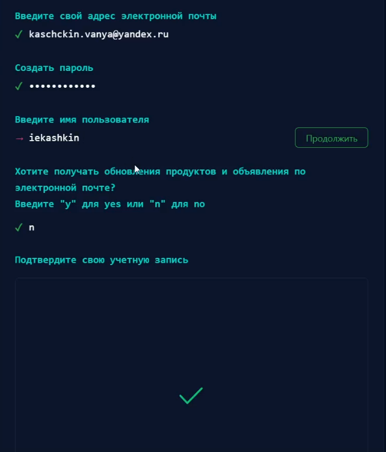{ #fig:001.1 width=70% }

{ #fig:001.2 width=70% }

2) Установка программного обеспечения:
-Мы начали выполнять этот пункт с установки git-flow н нашу виртуальную машину. Это программное обеспечение удалено из репозитория. Необходимо устанавливать его вручную: (рис. [-@fig:002.1)(рис. [-@fig:002.2)
    -1. «cd /tmp»
    -2. «wget --no-check-certificate -q https://raw.github.com/petervanderdoes/gitflow/develop/contrib/ gitflow-installer.sh»
    -3. «chmod    +x    gitflow-installer.sh»
    -4. «sudo ./gitflow-installer.sh install stable»
    
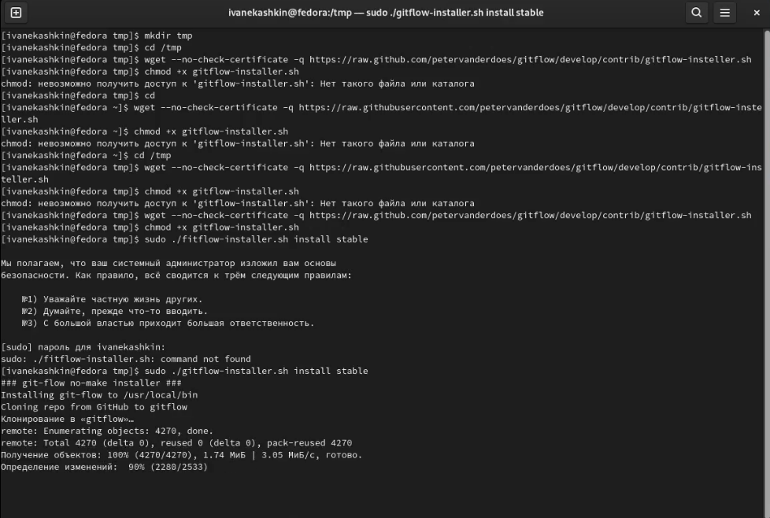{ #fig:002.1 width=70% }

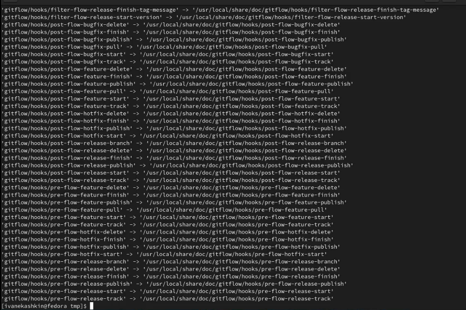{ #fig:002.2 width=70% }

-После этого нам нужно установить gh в Fedora Linux с помощью команды:
«sudo dnf install gh»(рис. [-@fig:003])

{ #fig:003 width=70% }

-Далее по лабораторной работе мы устанавливали базовые настройки git с помощью программ: (рис. [-@fig:004])
  -1. «git config --global user.name  "Name    Surname"» 
  -2. «git сonfig --global user.email  "work@mail"»
-Эти две команды выше задают имя и email владельца репозитория.
-Настроим utf-8 в выводе сообщений git с помощью: (рис. [-@fig:004]
   -1. «git config --global core.quotepath false»
-Настроим верификацию и подписание коммитов git. Зададим имя начальной ветки master: (рис. [-@fig:004])
   -1. «git сonfig --global init.defaultBranch  master»
-Настраиваем параметры autocrlf и safecrlf: (рис. [-@fig:004])
   -1. «git    config    --global    core.autocrlf    input» 
   -2. «git    config    --global    core.safecrlf    warn»
   
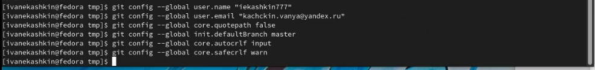{ #fig:004 width=70% }

-От этих действий мы перешли к созданию ключа ssh. По алгоритму rsa с ключём размером 4096 бит, а после по алгоритму ed25519, пишем комнды: (рис. [-@fig:005.1])(рис. [-@fig:005.2])
   -1. «ssh-keygen    -t    rsa    -b    4096»
   -2. «ssh-keygen    -t    ed25519»
   
{ #fig:005.1 width=70% }

{ #fig:005.2 width=70% }

-После создаем ключ gpg: (рис. [-@fig:006])
   -1. «gpg    --full-generate-key»
   
{ #fig:006 width=70% }

-Добавим этот ключ в GitHub (рис. [-@fig:007.1])(рис. [-@fig:007.2])(рис. [-@fig:007.3])(рис. [-@fig:007.4]) (<PGP    Fingerprint>    |    xclip    -sel    clip – Эта часть команды у меня не работал и я писал свой «Отпечаток_ключа»)

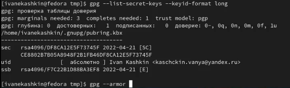{ #fig:007.1 width=70% }

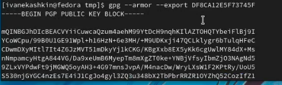{ #fig:007.2 width=70% }

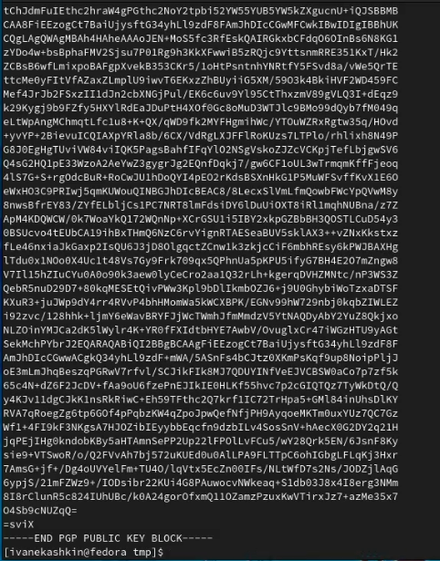{ #fig:007.3 width=70% }

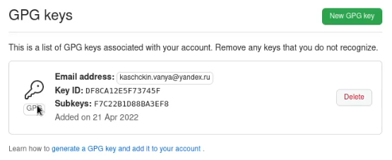{ #fig:007.4 width=70% }

-Далее идет настройка настройка  автоматических  подписей  коммитов  git. Мы используем введёный email, укажем Git применять его при подписи коммитов: (рис. [-@fig:008])
   -2. «git config --global user.signingkey «Отпечаток_ключа»»
   -3. «git    config    --global    commit.gpgsign    true»
   -4. «git    config    --global    gpg.program    $(which    gpg2)»
   
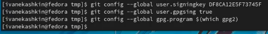{ #fig:008 width=70% }

-Настройка  gh и авторизация с помошью консоли (рис. [-@fig:009.1])(рис. [-@fig:009.2])

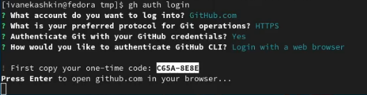{ #fig:009.1 width=70% }

{ #fig:009.2 width=70% }

-Мы создаем  репозиторий  курса  на  основе  шаблона (рис. [-@fig:0010.1])(рис. [-@fig:0010.2])
   -1. mkdir    -p    ~/work/study/2021-2022/"Операционные    системы" 
   -2. cd    ~/work/study/2021-2022/"Операционные    системы"
   -3. gh    repo    create    study_2021-2022_os-intro --template=yamadharma/course-directory-student-template    --public
   -4. git    clone    --recursive git@github.com:<iekashkin777>/study_2021-2022_os-intro.git    os-intro
   
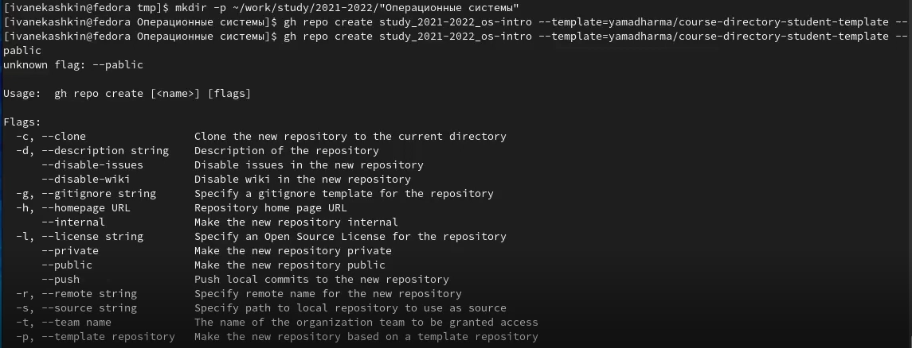{ #fig:0010.1 width=70% }

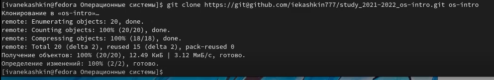{ #fig:0010.2 width=70% }

-И в конце идет настройка  каталога  курса (рис. [-@fig:0011.1])(рис. [-@fig:0011.2])(рис. [-@fig:0011.3])(рис. [-@fig:0011.4])
   -1. cd    ~/work/study/2021-2022/"Операционные    системы"/os-intro
   -2. rm    package.json
   -3. make    COURSE=os-intro
-Поеснение для этих команд: первая, мы заходим в каталог курса, вторая, удаляем не нужные файлы, третья, создаем необходимые каталоги

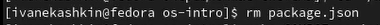{ #fig:0011.1 width=70% }

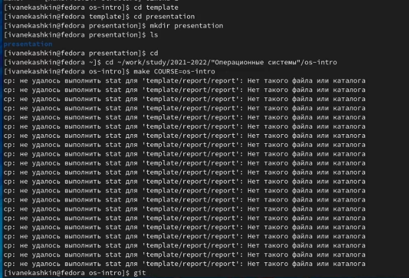{ #fig:0011.2 width=70% }

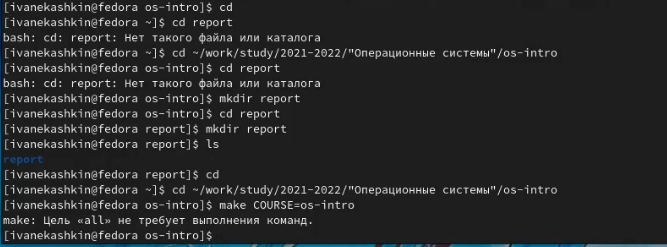{ #fig:0011.3 width=70% }

{ #fig:0011.4 width=70% }
# Выводы

Я изучил изучить идеологию и применение средств контроля версий. Освоил умения по работе с git.

