---
## Front matter
lang: ru-RU
title: Отчет по лабораторной работе №4
author: Кашкин Иван Евгеньевич
institute: РУДН, Москва, Россия
date: 28 апреля 2022 г.

## Formatting
toc: false
slide_level: 2
theme: metropolis
header-includes: 
 - \metroset{progressbar=frametitle,sectionpage=progressbar,numbering=fraction}
 - '\makeatletter'
 - '\beamer@ignorenonframefalse'
 - '\makeatother'
aspectratio: 43
section-titles: true
---

## Цель работы 

Приобретение практических навыков взаимодействия пользователя с системой посредством командной строки

## Задание

Прописать несколько базовых команд, посмотреть что произойдет и узнать подробную информацию об опциях каждой команды

## Домашний католог

Определяем полное имя нашего домашнего каталога (рис. [-@fig:001])

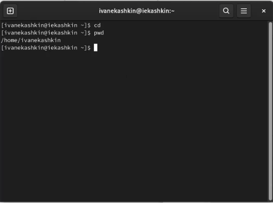{ #fig:001 width=70% }

## Выполнени команды ls и её опций

Выполняем несколько команд

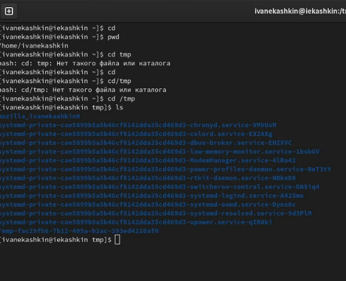{ #fig:002 width=70% }

##
  
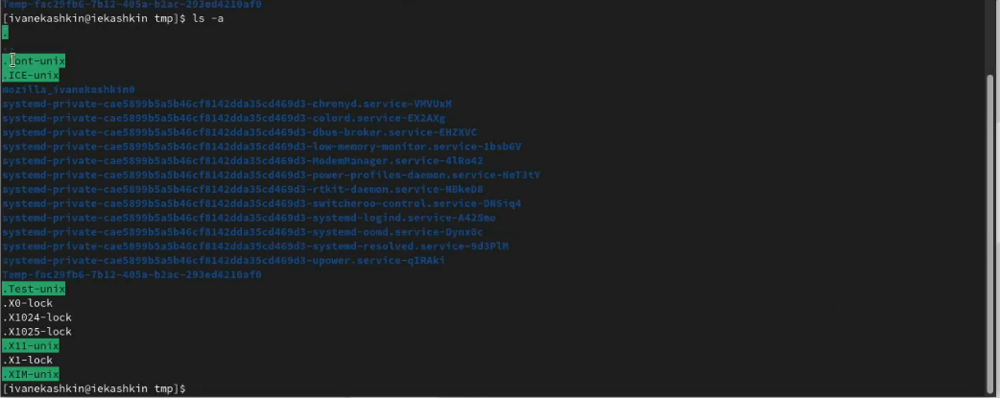{ #fig:003 width=70% }

##
  
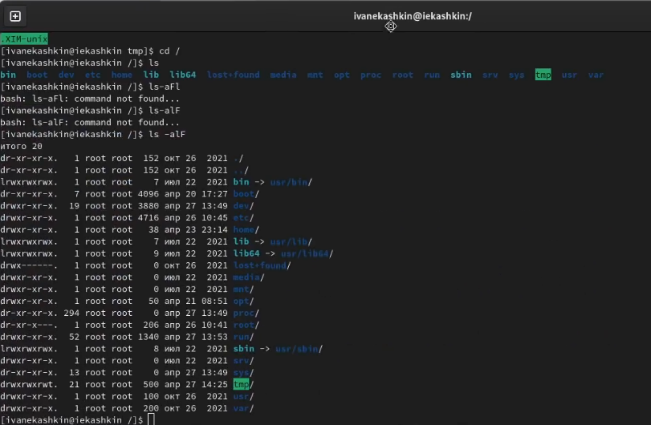{ #fig:004 width=70% }

##

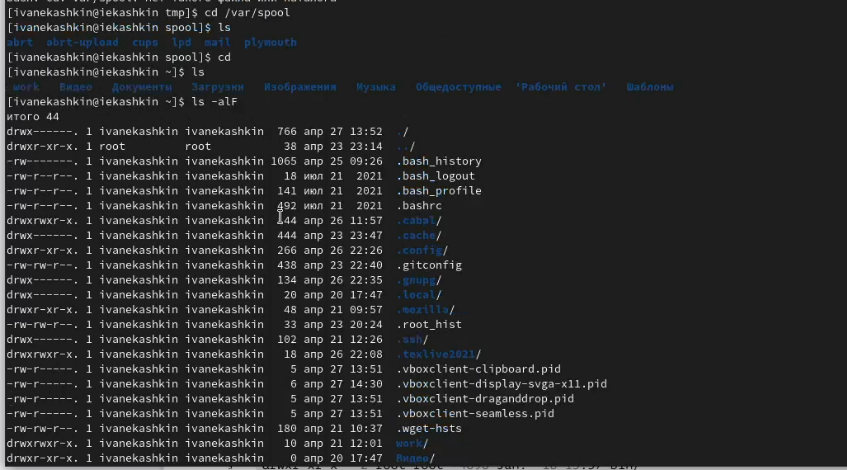{ #fig:005 width=70% }

## Выполнение команд mkdir, rmdir, rm
Выполняем следующие команды 

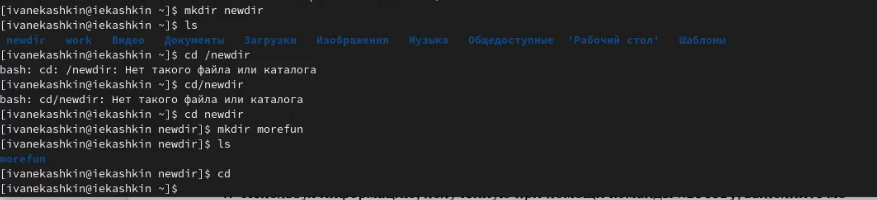{ #fig:006 width=70% }

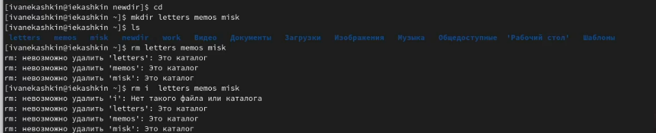{ #fig:007 width=70% }

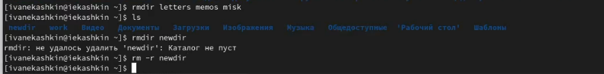{ #fig:008 width=70% }

## Команда man для просмотра опций 

С помощью команды man определим, опцию ls для просмотра содержимое нетолько указанного каталога, но и подкаталогов, входящих в него. И также командой man ls узнаем опцию, позволяющий отсортировать по времени последнего изменения выводимый список содержимого каталога с развёрнутым описанием файлов. 

## Просмотр опций 

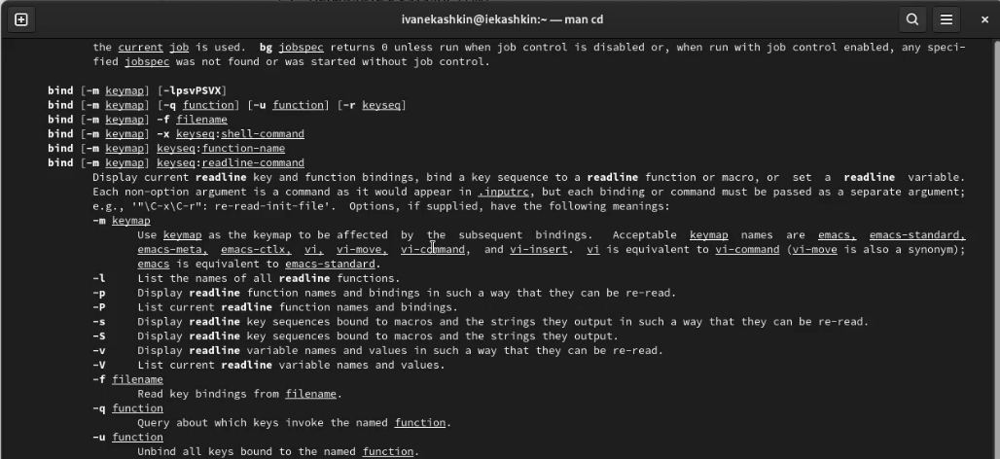{ #fig:0011 width=70% }

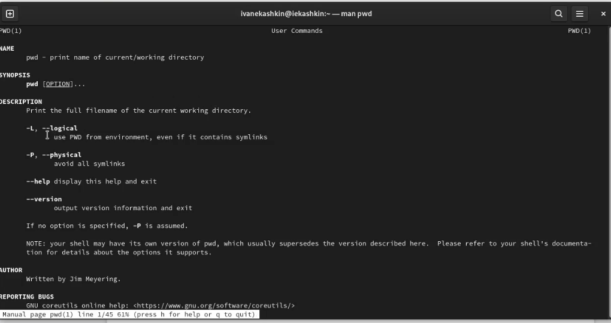{ #fig:0012 width=70% }

##

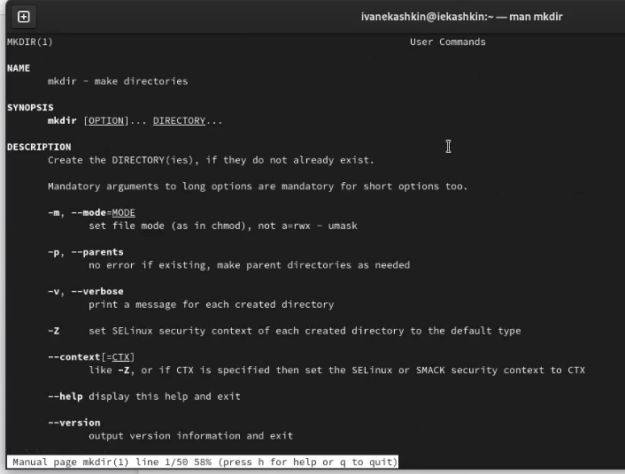{ #fig:0013 width=70% } 

##

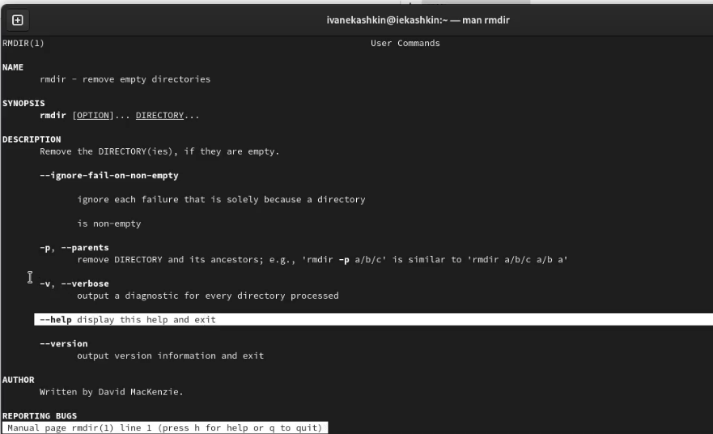{ #fig:0014 width=70% }

##

{ #fig:0015 width=70% }

## Вывод

Приобрел практические навыков взаимодействия пользователя с системой посредством командной строки

## {.standout}

Спасибо за внимание!
