---
## Front matter
title: "Oтчет по лабораторной работе №4"
subtitle: "Дисциплина: Операционные системы"
author: "Кашкин Иввн Евгеньевич"

## Generic otions
lang: ru-RU
toc-title: "Содержание"

## Bibliography
bibliography: bib/cite.bib
csl: pandoc/csl/gost-r-7-0-5-2008-numeric.csl

## Pdf output format
toc: true # Table of contents
toc-depth: 2
lof: true # List of figures
lot: true # List of tables
fontsize: 12pt
linestretch: 1.5
papersize: a4
documentclass: scrreprt
## I18n polyglossia
polyglossia-lang:
  name: russian
  options:
	- spelling=modern
	- babelshorthands=true
polyglossia-otherlangs:
  name: english
## I18n babel
babel-lang: russian
babel-otherlangs: english
## Fonts
mainfont: PT Serif
romanfont: PT Serif
sansfont: PT Sans
monofont: PT Mono
mainfontoptions: Ligatures=TeX
romanfontoptions: Ligatures=TeX
sansfontoptions: Ligatures=TeX,Scale=MatchLowercase
monofontoptions: Scale=MatchLowercase,Scale=0.9
## Biblatex
biblatex: true
biblio-style: "gost-numeric"
biblatexoptions:
  - parentracker=true
  - backend=biber
  - hyperref=auto
  - language=auto
  - autolang=other*
  - citestyle=gost-numeric
## Pandoc-crossref LaTeX customization
figureTitle: "Рис."
tableTitle: "Таблица"
listingTitle: "Листинг"
lofTitle: "Список иллюстраций"
lotTitle: "Список таблиц"
lolTitle: "Листинги"
## Misc options
indent: true
header-includes:
  - \usepackage{indentfirst}
  - \usepackage{float} # keep figures where there are in the text
  - \floatplacement{figure}{H} # keep figures where there are in the text
---

# Цель работы

-Приобретение практических навыков взаимодействия пользователя с системой посредством командной строки

# Задание

-1.Определите полное имя вашего домашнего каталога.Далее относительно этого каталога будут выполняться последующие упражнения.
-2.Выполните следующие действия:
  -2.1. Перейдите в каталог /tmp.
  -2.2. Выведите на экран содержимое каталога /tmp.Для этого используйте команду ls
с различными опциями.Поясните разницу в выводимой на экран информации.
  -2.3. Определите,естьли в каталоге /var/spool подкаталог с именем cron?
  -2.4. Перейдите в Ваш домашний каталог и выведите на экран его содержимое.Определите,кто является владельцем файлов и подкаталогов?
-3.Выполните следующие действия:
  -3.1. В домашнем каталоге создайте новый каталог с именем newdir.
  -3.2. В каталоге ~/newdir создайте новый каталог с именем morefun.
  -3.3. В домашнем каталоге создайте одной командойтри новых каталога с именами letters,memos,misk.Затем удалите эти каталоги одной командой.
  -3.4. Попробуйте удалить ранее созданный каталог ~/newdir командой rm.Проверьте, был ли каталог удалён.
  -3.5. Удалите каталог ~/newdir/morefun из домашнего каталога.Проверьте,был ли каталогудалён.
-4.С помощью команды man определите, какую опцию команды ls нужно использоватьдля просмотра содержимое нетолько указанного каталога, но и подкаталогов, входящих в него.
-5.Спомощьюкомандыman определитенаборопцийкоманды ls,позволяющийотсортировать по времени последнего изменения выводимый список содержимого каталога с развёрнутым описанием файлов.
-6.Используйте команду man для просмотра описания следующих команд: cd,pwd,mkdir, rmdir,rm.Поясните основные опции этих команд.
-7.Используя информацию,полученную при помощи команды history,выполните модификацию и исполнение нескольких команд из буфера команд.

# Теоретическое введение

**Терминал**

-В операционной системе UNIX основными средствами взаимодействия пользователя с системой являются клавиатура и экран монитора, работающий в текстовом режиме. Вводимый пользователем текст немедленно отображается на мониторе соответствующими знаками, однако может и не отображаться (например, в случае ввода пароля). Для управления вводом используются некоторые нетекстовые клавиши на клавиатуре: Backspace (он же «Забой») – для удаления последнего введенного символа или Enter – для передачи команды системе. Нажатие на эти клавиши не приводит к отображению символа, вместо этого вводимый текст обрабатывается системой тем или иным способом – эти клавиши и их комбинации объединяют понятием управляющие символы. 

**Командная оболочка**

-Основная среда взаимодействия с UNIX – командная строка. Суть её в том, что каждая строка, передаваемая пользователем системе, – это команда, которую та должна выполнить. Пока не нажата клавиша Enter, строку можно редактировать, затем она отсылается системе.

# Выполнение лабораторной работы

-1)Определяем полное имя нашего домашнего каталога (рис. [-@fig:001])

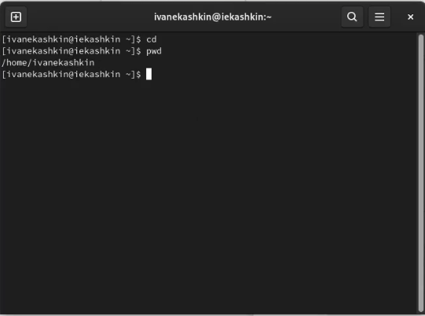{ #fig:001 width=70% }

-2)Выполняем несколько команд:
  -2.1 Перейдем в каталог /tmp (рис. [-@fig:002]) 
  -2.2 Выедем на экран содержимое каталога /tmp. Для этого используйте команду ls
с различными опциями. (рис. [-@fig:002]) 
  -2.3 Определим,есть ли в каталоге /var/spool подкаталог с именем cron? Его нет. (рис. [-@fig:004]) 
  -2.4. Перейдем в наш домашний каталог и выведем на экран его содержимое. Определим,кто является владельцем файлов и подкаталогов? Владельцем пости всех файлов являюсь я. (рис. [-@fig:005]) 
  
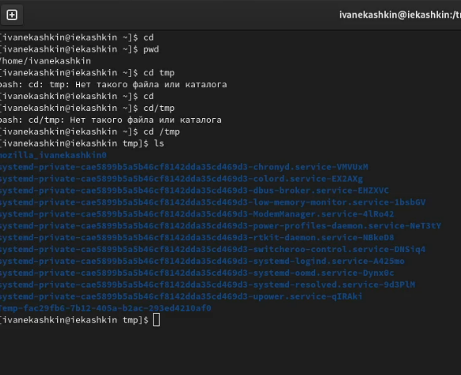{ #fig:002 width=70% }
  
{ #fig:003 width=70% }
  
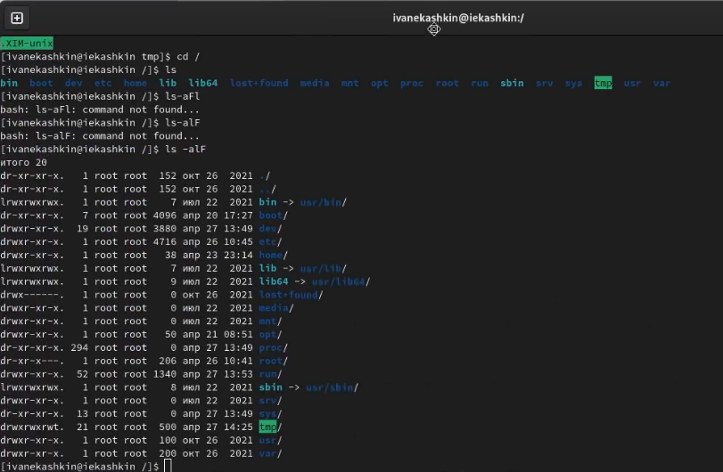{ #fig:004 width=70% }
  
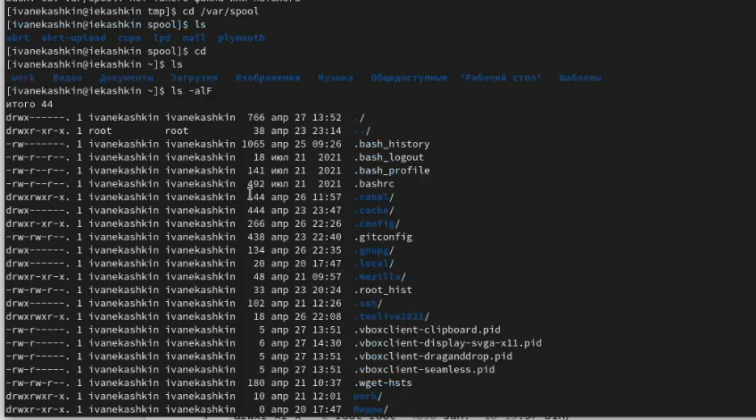{ #fig:005 width=70% }
  
-3)Выполните следующие действия:
  -3.1. В домашнем каталоге создайте новый каталог с именем newdir. (рис. [-@fig:006]) 
  -3.2. В каталоге ~/newdir создайте новый каталог с именем morefun. (рис. [-@fig:006])
  -3.3. В домашнем каталоге создайте одной командойтри новых каталога с именами letters,memos,misk.Затем удалите эти каталоги одной командой.(рис. [-@fig:007])(рис. [-@fig:008]) 
  -3.4. Попробуйте удалить ранее созданный каталог ~/newdir командой rm.Проверьте, был ли каталог удалён. (рис. [-@fig:008]) 
  -3.5. Удалите каталог ~/newdir/morefun из домашнего каталога.Проверьте,был ли каталогудалён. (рис. [-@fig:008]) 

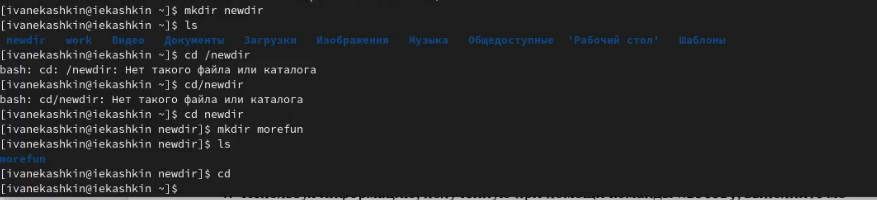{ #fig:006 width=70% }

{ #fig:007 width=70% }

{ #fig:008 width=70% }

-4)С помощью команды man определим, какую опцию команды ls нужно использовать для просмотра содержимое нетолько указанного каталога,но и подкаталогов, входящих в него. (рис. [-@fig:009])

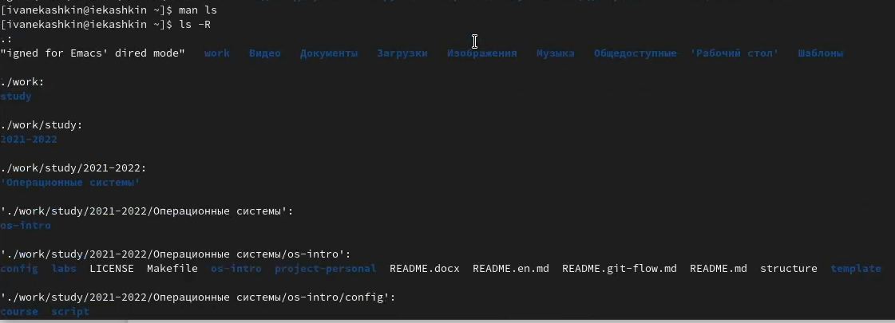{ #fig:009 width=70% }

-5)С помощью команды man определим набор опций команды ls,позволяющий отсортировать по времени последнего изменения выводимый список содержимого каталога с развёрнутым описанием файлов. (рис. [-@fig:0010])

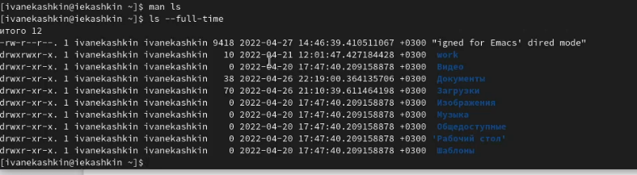{ #fig:0010 width=70% }

-6)Используйте команду man для просмотра описания следующих команд: cd,pwd,mkdir, rmdir,rm. (рис. [-@fig:0011])(рис. [-@fig:0012])(рис. [-@fig:0013])(рис. [-@fig:0014])(рис. [-@fig:0015])

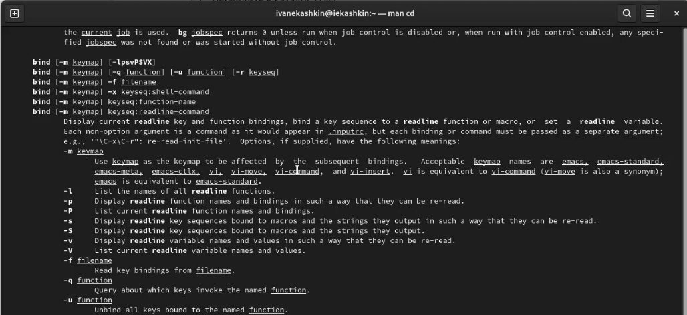{ #fig:0011 width=70% }

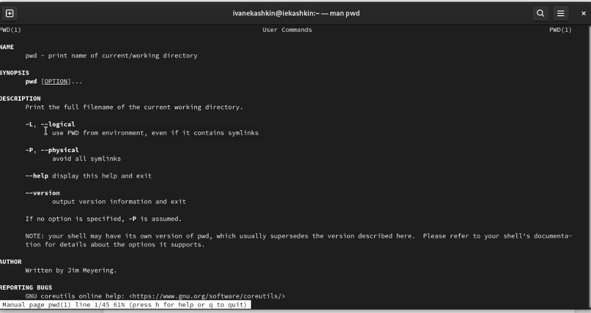{ #fig:0012 width=70% }

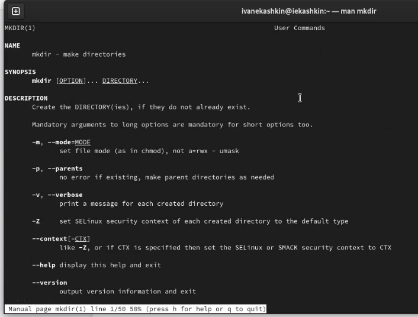{ #fig:0013 width=70% }

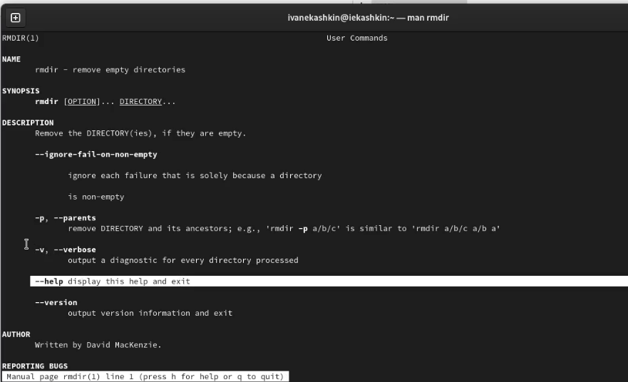{ #fig:0014 width=70% }

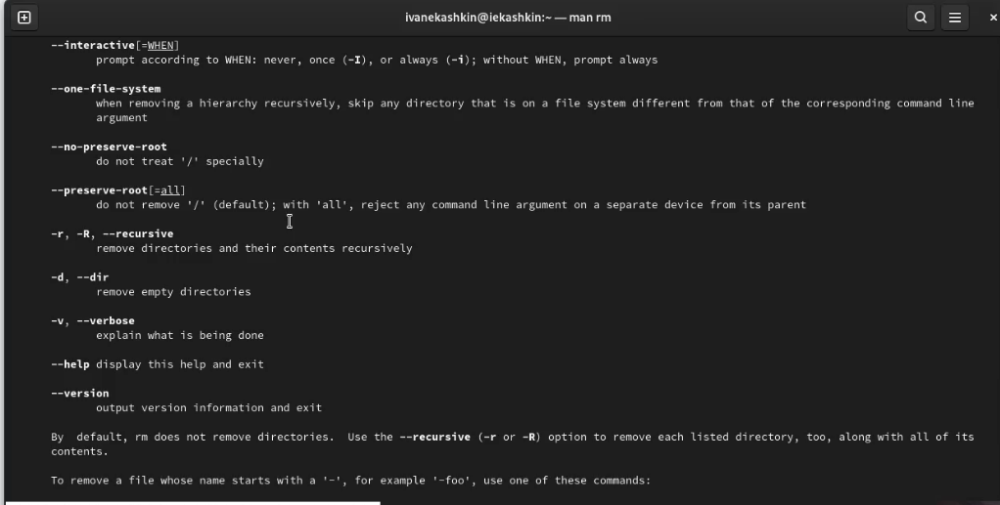{ #fig:0015 width=70% }

-7)Используя информацию,полученную при помощи команды history,выполним модификацию и исполнение нескольких команд из буфера команд. (рис. [-@fig:0016])

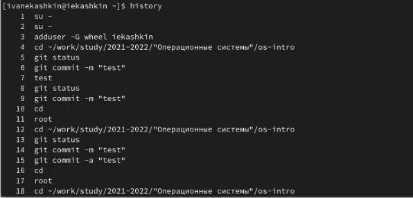{ #fig:0016 width=70% }

# Выводы

-Приобрел практические навыков взаимодействия пользователя с системой посредством командной строки

# Контрольные вопросы

-1)Командная строка – специальная программа, позволяющая управлять операционной системой при помощи текстовых команд, вводимых в окне приложения.
-2)Для определения абсолютного пути к текущему каталогу используется команда pwd (print working directory). Например, команда «pwd» в моем домашнем каталоге выведет: /home/daavetisyan.
-3)Команда «ls -F» (или «ls -aF», тогда появятся еще скрытые файлы) выведет имена файлов в текущем каталоге и их типы. Тип каталога обозначается /, тип исполняемого файла обозначается *, тип ссылки обозначается @.
-4)Имена скрытых файлов начинаются с точки. Эти файлы в операционной системе скрыты от просмотра и обычно используются для настройки рабочей среды. Для того, чтобы отобразить имена скрытых файлов, необходимо использовать команду «ls –a».
-5)Команда rm используется для удаления файлов и/или каталогов. Команда rm -i выдает запрос подтверждения на удаление файла. Команда rm -r необходима, чтобы удалить каталог, содержащий файлы. Без указания этой опции команда не будет выполняться. Если каталог пуст, то можно воспользоваться командой rmdir. Если удаляемый каталог содержит файлы, то команда не будет выполнена – нужно использовать «rm -r имя_каталога». Таким образом, каталог, не содержащий файлов, можно удалить и командой rm, и командой rmdir. Файл командой rmdir удалить нельзя.
-6)Чтобы определить, какие команды выполнил пользователь в сеансе работы, необходимо воспользоваться командой «history».
-7)Чтобы исправить или запустить на выполнение команду, которую пользователь уже использовал в сеансе работы, необходимо: в первом случае: воспользоваться конструкцией !<номер_команды>:s/<что_меняем>/<на_что_меняем>, во втором случае: !<номер_команды>.
-8)Чтобы записать в одной строке несколько команд, необходимо между ними поставить ; . Например, «cd /tmp; ls».
-9)Символ обратного слэша \ позволяет использовать управляющие символы ( ".", "/", "$", "*", "[", "]", "^", "&") без их интерпретации командной оболочкой; процедура добавления данного символа перед управляющими символами называется экранированием символов. Например, команда «ls newdir/morefun» отобразит содержимое каталога newdir/morefun.
-10)Команда «ls -l» отображает список каталогов и файлов с подробной информацией о них (тип файла, право доступа, число ссылок, владелец, размер, дата последней ревизии, имя файла или каталога).
-11)Полный, абсолютный путь от корня файловой системы – этот путь начинается от корня "/" и описывает весь путь к файлу или каталогу; Относительный путь – это путь к файлу относительно текущего каталога (каталога, где находится пользователь). Например, «cd /newdir/morefun» - абсолютный путь, «cd newdir» – относительный путь.
-12)Чтобы получить необходимую информацию о команде, необходимо воспользоваться конструкцией man имя_команды, либо использовать опцию help, которая предусмотрена для некоторых команд.
-13)Для автоматического дополнения вводимых команд служит клавиша Tab.

# Список литературы{.unnumbered}

::: {#http://heap.altlinux.org/modules/unix_base_admin.dralex/ch02.html}
:::
