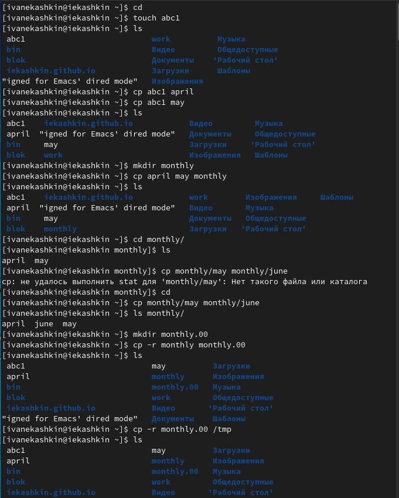
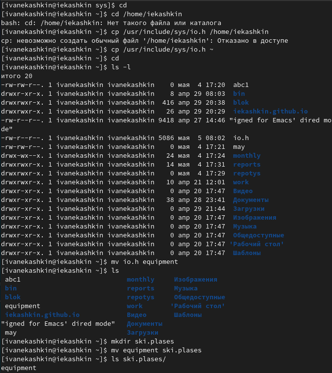
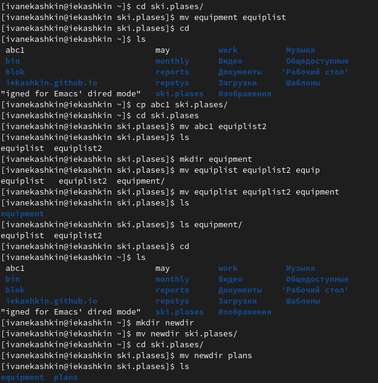
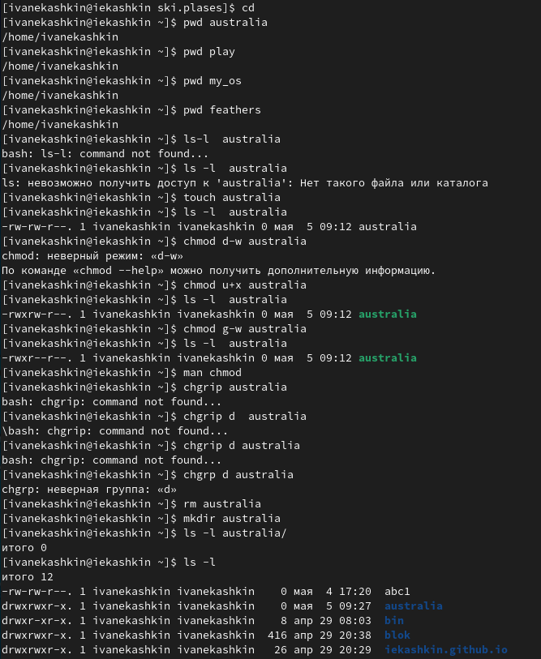
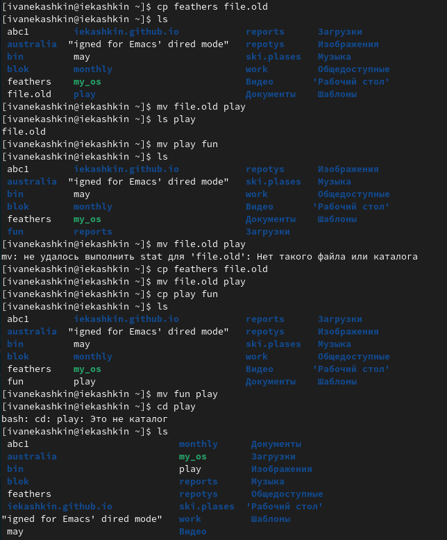
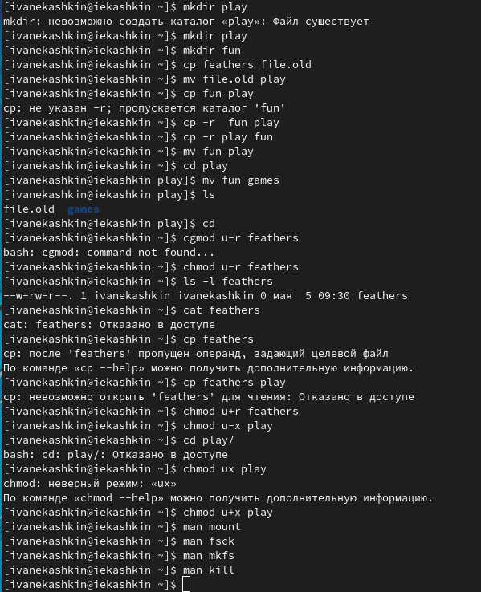

---
## Front matter
lang: ru-RU
title: Отчет по лабораторной работе №5
author: Кашкин Иван Евгеньевич
institute: РУДН, Москва, Россия
date: 6 мая 2022 г.

## Formatting
toc: false
slide_level: 2
theme: metropolis
header-includes: 
 - \metroset{progressbar=frametitle,sectionpage=progressbar,numbering=fraction}
 - '\makeatletter'
 - '\beamer@ignorenonframefalse'
 - '\makeatother'
aspectratio: 43
section-titles: true
---

## Цель работы 

Ознакомление с файловой системой Linux, её структурой, именами и содержанием каталогов. Приобретение практических навыков по применению команд для работы с файлами и каталогами, по управлению процессами (и работами), по проверке использования диска и обслуживанию файловой системы

## Задание

Выполнение задания по указанию работы, прописование и изучение команд и их опций в консоли

## Примеры 

Выполняем все примеры, приведенные в первой части опиания лабораторной работы (рис. [-@fig:001])

{ #fig:001 width=70% }

## Работаем с командыми добавления, копирования, переименовывания файлов и катологов

Выполняем несколько команд

{ #fig:002 width=70% }

##
  
{ #fig:003 width=70% }

## Команда сhmod и права работы с файлом
Определите опции команды chmod, необходимые для того, чтобы присвоить перечисленным ниже файлам выделенные права доступа (рис. [-@fig:007]) 

{ #fig:004 width=70% }

## Команды работы прав на использования для катологов и файлов

Выполнение нескольких команд 

{ #fig:005 width=70% }

## Просмотр опций 

{ #fig:006 width=70% }

##Использование команды man

Прочитали man по командам mount, fsck, mkfs, kill и я кратко их охарактеризовал в записи работы (рис. [-@fig:007])

{ #fig:0010 width=70% }

## Вывод

Ознакомился с файловой системой Linux, её структурой, именами и содержанием каталогов. Приобрел практические навыков по применению команд для работы с файлами и каталогами, по управлению процессами (и работами), по проверке использования диска и обслуживанию файловой системы

## {.standout}

Спасибо за внимание!
