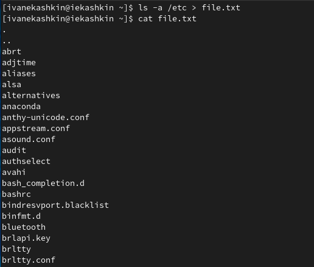
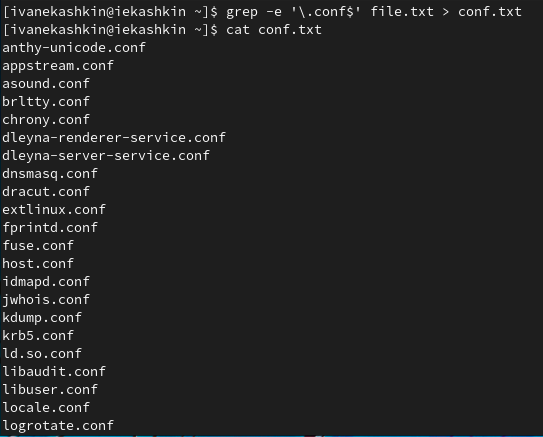
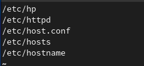
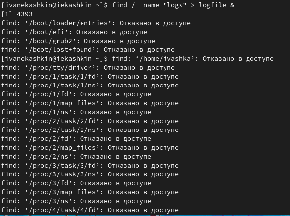
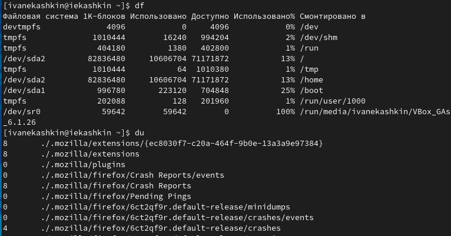
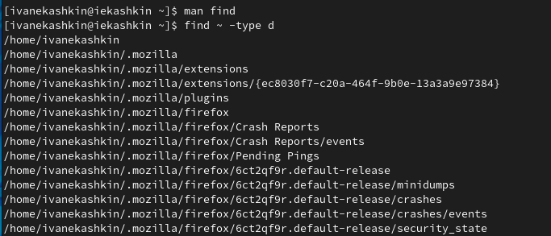

---
## Front matter
lang: ru-RU
title: Отчет по лабораторной работе №6
author: Кашкин Иван Евгеньевич
institute: РУДН, Москва, Россия
date: 6 мая 2022 г.

## Formatting
toc: false
slide_level: 2
theme: metropolis
header-includes: 
 - \metroset{progressbar=frametitle,sectionpage=progressbar,numbering=fraction}
 - '\makeatletter'
 - '\beamer@ignorenonframefalse'
 - '\makeatother'
aspectratio: 43
section-titles: true
---

## Цель работы 

Ознакомится с инструментами поиска файлов и фильтрации текстовых данных. Приобретение практических навыков: по управлению процессами (и заданиями), по проверке использования диска и обслуживанию файловых систем

## Задание

Выполнить все указания к работе и узнать информацию о них и их опциях

## Работа с файлами

Осуществили вход в систему, используя соответствующее имя пользователя  Записали в файл file.txt названия файлов, содержащихся в каталоге /etc. (ls -a /etc > file.txt).Допишим в этот же файл названия файлов, содержащихся в вашем домашнем каталоге (ls -a ~ >> file.txt) (рис. [-@fig:001])

{ #fig:001 width=70% }

## Вывод имен файлов по критерию

Выведем имена всех файлов из file.txt, имеющих расширение .conf, после чего записали их в новый текстовой файл conf.txt. (grep -e '\.conf&' file.txt > conf.txt) (рис. [-@fig:002])

{ #fig:004 width=70% }

## Команды для поиска файлов
  
Определим, какие файлы в вашем домашнем каталоге имеют имена, начинавшиеся с символа c? Вот несколько команд:
-"find ~ -name "c*" -print" 
-"find ~ -maxdepth 1 -name "c*" -print"
-"ls ~/c*" 

## Поиск файлов в /etc
Выведем на экран (по странично) имена файлов из каталога /etc, начинающиеся с символа h. (рис. [-@fig:005])

{ #fig:005 width=70% }

## Запуск в фоновом режиме

Запустим в фоновом режиме процесс, который будет записывать в файл ~/logfile файлы, имена которых начинаются с log.(find / -name "log*" > logfile &) Удалим файл ~/logfile. (rm logfile) (рис. [-@fig:006])

(рис. [-@fig:006])

## Gedit

Запустим из консоли в фоновом режиме редактор gedit. Определим идентификатор процесса gedit, используя команду ps, конвейер и фильтр grep. Используем несколько способов.

##Использование команды df & du

{ #fig:0011 width=70% }

##Find
{ #fig:0012 width=70% }

## Вывод

В ходе работы ознакомился с инструментами поиска файлов и фильтрации текстовых данных. Приобрел практических навыков: по управлению процессами (и заданиями), по проверке использования диска и обслуживанию файловых систем

## {.standout}

Спасибо за внимание!
