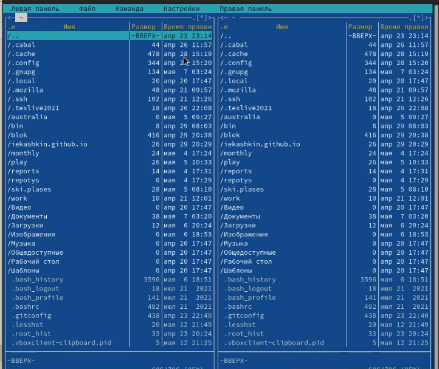
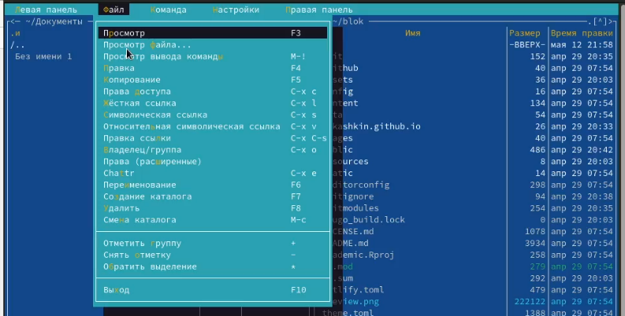
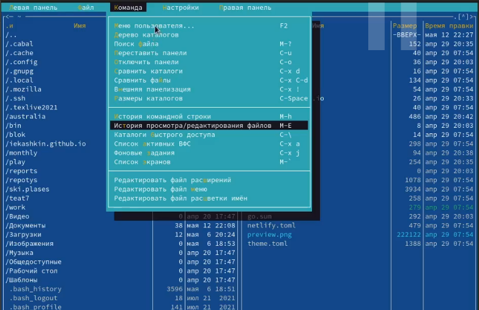
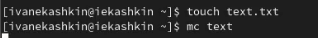
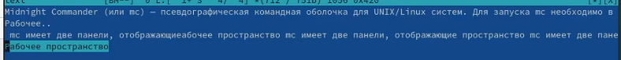

---
## Front matter
lang: ru-RU
title: Отчет по лабораторной работе №7
author: Кашкин Иван Евгеньевич
institute: РУДН, Москва, Россия
date: 6 мая 2022 г.

## Formatting
toc: false
slide_level: 2
theme: metropolis
header-includes: 
 - \metroset{progressbar=frametitle,sectionpage=progressbar,numbering=fraction}
 - '\makeatletter'
 - '\beamer@ignorenonframefalse'
 - '\makeatother'
aspectratio: 43
section-titles: true
---

## Цель работы 

Освоение основных возможностей командной оболочки Midnight Commander. Приобретение навыков практической работы по просмотру каталогов и файлов; манипуляций с ними

## Задание

Выполнить все указания к работе: задание по mc, задание по встроенному редактору mc

## Начало работы с mc 

Изучили информацию о mc, вызвав в командной строке "man mc" Запустили из командной строки mc, изучили его структуру и меню. Выполнили несколько операций в mc, используя управляющие клавиши 

{ #fig:001 width=70% }

## Подменю Файл

Использую подменю "Файл" мы посмотрели содержимое текстового файла, редактиовали содержимое этого файла, создали новый каталог и копировали файл в этот каталог

{ #fig:002 width=70% }

## Подменю Команды
  
Используя подменю "Команды" мы искали файл в файловой системы с заданными параметрами, повторили одну из предыдущих команд, вернулись в домашний каталог и проанализировали файловое меню

{ #fig:003 width=70% }

## Файл text 

Создали текстовой файл text.txt и открыли его с помощью встроенного в mc редактора. Вставили фрагмент текста из лабораторной работы в файл

{ #fig:004 width=70% }

## Выполнеие Указаний с файлом

{ #fig:005 width=70% }

## Вывод

Смог освоить основные возможности командной оболочки Midnight Commander. Приобрел навыки практической работы по просмотру каталогов и файлов; манипуляций с ними

## {.standout}

Спасибо за внимание!
