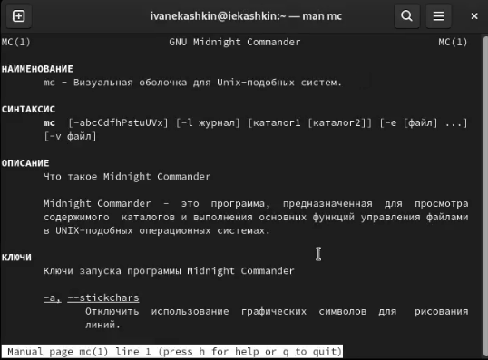
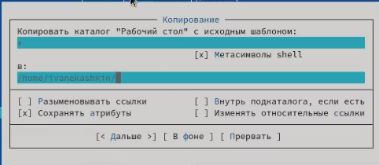
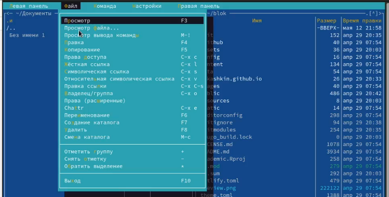
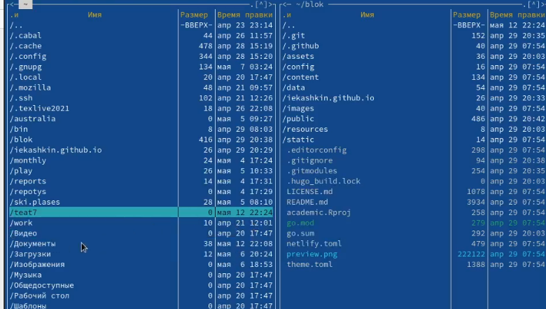
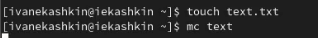
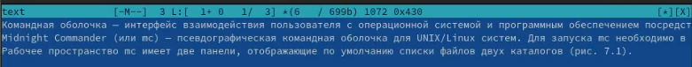
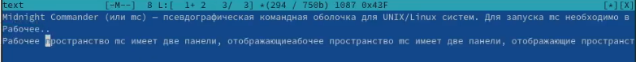
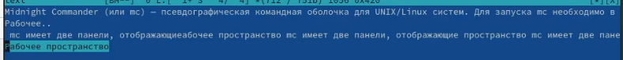
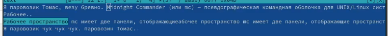

---
## Front matter
title: "Oтчет по лабораторной работе №7"
subtitle: "Дисциплина: Операционные системы"
author: "Кашкин Иввн Евгеньевич"

## Generic otions
lang: ru-RU
toc-title: "Содержание"

## Bibliography
bibliography: bib/cite.bib
csl: pandoc/csl/gost-r-7-0-5-2008-numeric.csl

## Pdf output format
toc: true # Table of contents
toc-depth: 2
lof: true # List of figures
lot: true # List of tables
fontsize: 12pt
linestretch: 1.5
papersize: a4
documentclass: scrreprt
## I18n polyglossia
polyglossia-lang:
  name: russian
  options:
	- spelling=modern
	- babelshorthands=true
polyglossia-otherlangs:
  name: english
## I18n babel
babel-lang: russian
babel-otherlangs: english
## Fonts
mainfont: PT Serif
romanfont: PT Serif
sansfont: PT Sans
monofont: PT Mono
mainfontoptions: Ligatures=TeX
romanfontoptions: Ligatures=TeX
sansfontoptions: Ligatures=TeX,Scale=MatchLowercase
monofontoptions: Scale=MatchLowercase,Scale=0.9
## Biblatex
biblatex: true
biblio-style: "gost-numeric"
biblatexoptions:
  - parentracker=true
  - backend=biber
  - hyperref=auto
  - language=auto
  - autolang=other*
  - citestyle=gost-numeric
## Pandoc-crossref LaTeX customization
figureTitle: "Рис."
tableTitle: "Таблица"
listingTitle: "Листинг"
lofTitle: "Список иллюстраций"
lotTitle: "Список таблиц"
lolTitle: "Листинги"
## Misc options
indent: true
header-includes:
  - \usepackage{indentfirst}
  - \usepackage{float} # keep figures where there are in the text
  - \floatplacement{figure}{H} # keep figures where there are in the text
---

# Цель работы

- Освоение основных возможностей командной оболочки Midnight Commander. Приобретение навыков практической работы по просмотру каталогов и файлов; манипуляций с ними

# Задание

**Задание по mc**

- 1. Изучите информацию о mc, вызвав в командной строке man mc.
- 2. Запустите из командной строки mc, изучите его структуру и меню.
- 3. Выполните несколько операций в mc, используя управляющие клавиши (операции с панелями; выделение/отмена выделения файлов, копирование/перемещение файлов, получение информации о размере и правах доступа на файлы и/или каталоги и т.п.)
- 4. Выполните основные команды меню левой (или правой) панели. Оцените степень подробности вывода информации о файлах.
- 5. Используя возможности подменю Файл , выполните:
– просмотр содержимого текстового файла;
– редактирование содержимого текстового файла (без сохранения результатов редактирования);
– создание каталога;
– копирование в файлов в созданный каталог.
- 6. С помощью соответствующих средств подменю Команда осуществите:
– поиск в файловой системе файла с заданными условиями (например, файла с расширением .c или .cpp, содержащего строку main);
– выбор и повторение одной из предыдущих команд;
– переход в домашний каталог;
– анализ файла меню и файла расширений.
- 7. Вызовите подменю Настройки . Освойте операции, определяющие структуру экрана mc (Full screen, Double Width, Show Hidden Files)

**Задание по встроенному редактору mc**

- 1. Создайте текстовой файл text.txt.
- 2. Откройте этот файл с помощью встроенного в mc редактора.
- 3. Вставьте в открытый файл небольшой фрагмент текста, скопированный из любого другого файла или Интернета.
- 4. Проделайте с текстом следующие манипуляции, используя горячие клавиши:
- 4.1. Удалите строку текста.
- 4.2. Выделите фрагмент текста и скопируйте его на новую строку.
- 4.3. Выделите фрагмент текста и перенесите его на новую строку.
- 4.4. Сохраните файл.
- 4.5. Отмените последнее действие.
- 4.6. Перейдите в конец файла (нажав комбинацию клавиш) и напишите некоторый текст.
- 4.7. Перейдите в начало файла (нажав комбинацию клавиш) и напишите некоторый текст.
- 4.8. Сохраните и закройте файл.
- 5. Откройте файл с исходным текстом на некотором языке программирования (например C или Java)
- 6. Используя меню редактора, включите подсветку синтаксиса, если она не включена, или выключите, если она включ

# Теоретическое введение

**Общие сведенья**

- Командная оболочка — интерфейс взаимодействия пользователя с операционной системой и программным обеспечением посредством команд. 
- Midnight Commander (или mc) — псевдографическая командная оболочка для UNIX/Linux систем. Для запуска mc необходимо в командной строке набрать mc и нажать Enter. 
- Рабочее пространство mc имеет две панели, отображающие по умолчанию списки файлов двух каталогов. Над панелями располагается меню, доступ к которому осуществляется с помощью клавиши F9 . Под панелями внизу расположены управляющие экранные кнопки, ассоциированные с функциональными клавишами F1 – F10 Над ними располагается командная строка, предназначенная для ввода команд.

# Выполнение лабораторной работы

1. Изучили информацию о mc, вызвав в командной строке "man mc" (рис. [-@fig:001])

{ #fig:001 width=70% }

2. Запустили из командной строки mc, изучили его структуру и меню (рис. [-@fig:002]) Выполнили несколько операций в mc, используя управляющие клавиши: выделение/отмена выделения файлов, копирование/перемещение файлов, получение информации о размере и правах доступа на файлы и/или каталоги (рис. [-@fig:003])

{ #fig:001 width=70% }

{ #fig:002 width=70% }

3. ыполнили основные команды меню левой панели. Информация о файлвх достаточно подробна, все необходимые данные выводятся на экран.
  

- Использую подменю "Файл" мы посмотрели содержимое текстового файла, редактиовали содержимое этого файла, создали новый каталог и копировали файл в этот каталог.(рис. [-@fig:004]) (рис. [-@fig:005]) 
  
{ #fig:004 width=70% }

{ #fig:005 width=70% }

4. Используя подменю "Команды" мы искали файл в файловой системы с заданными параметрами, повторили одну из предыдущих команд, вернулись в домашний каталог и проанализировали файловое меню.(рис. [-@fig:006]) 
  
{ #fig:006 width=70% }
  
5. Создали текстовой файл text.txt и открыли его с помощью встроенного в mc редактора (рис. [-@fig:007])}

{ #fig:007 width=70% }

- Вставили фрагмент текста из лабораторной работы в файл (рис. [-@fig:008])

{ #fig:008 width=70% }

6.  Далле мы выполнели следующие действия: удалили строку текста, выделили фрагмент текста и скопировали его на новую строку, его же перенесли на новую строку, сохранили файл,(рис. [-@fig:009]) 
-Отменили последнее действие, перешли в конец файла и написали некоторый текст, а после тоже самое только в начале файла, сохранили и закрыли файл (рис. [-@fig:0010]) (рис. [-@fig:0011]) 

{ #fig:009 width=70% }

{ #fig:0010 width=70% }

{ #fig:0011 width=70% }

# Выводы

- Смог освоить основные возможности командной оболочки Midnight Commander. Приобрел навыки практической работы по просмотру каталогов и файлов; манипуляций с ними

# Список литературы{.unnumbered}

::: {#Лабораторная работа №7. Командная оболочка Midnight Commander. Кулябов Д.С. и др. Операционные системы }
:::
