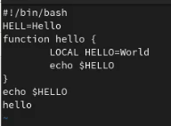
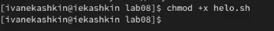
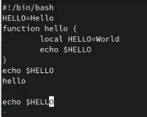

---
## Front matter
lang: ru-RU
title: Отчет по лабораторной работе №8
author: Кашкин Иван Евгеньевич
institute: РУДН, Москва, Россия
date: 6 мая 2022 г.

## Formatting
toc: false
slide_level: 2
theme: metropolis
header-includes: 
 - \metroset{progressbar=frametitle,sectionpage=progressbar,numbering=fraction}
 - '\makeatletter'
 - '\beamer@ignorenonframefalse'
 - '\makeatother'
aspectratio: 43
section-titles: true
---

## Цель работы 

Познакомиться с операционной системой Linux. Получить практические навыки работы с редактором vi, установленным по умолчанию практически во всех дистрибутивах

## Задание

Выполнить задания в лабораторной работе: Задание 1, Задание 2

## Начало Задание 1

В созданный католог лабораторной работы создаем файл hello.sh с помощью командв "vi hello.sh" Пичатаем заданный текст, нажимая "i" переходя в режим ввода текста

{ #fig:001 width=70% }

## Исполняемый файл

Делаем наш файл исполняемым

{ #fig:002 width=70% }

## Задние 2
  
Вызовим файл на редоктирование "vi hello.sh" В режиме вставки заменяем "HELL" на "HELLO" Далле в режиме команд стираем LOCAL и в режиме вставка меняем на local

{ #fig:003 width=70% }

## Файл text 

После в последней строке вставляем текст: echo $HELLO, затем в командном режиме удаляем последнююю строку.

{ #fig:004 width=70% }

## Вывод

Познакомился с операционной системой Linux. Получил практические навыки работы с редактором vi, установленным по умолчанию практически во всех дистрибутивах

## {.standout}

Спасибо за внимание!
