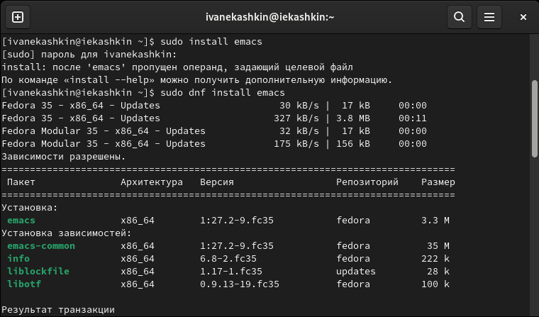
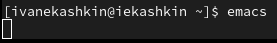
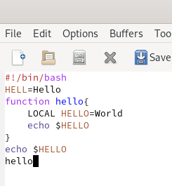
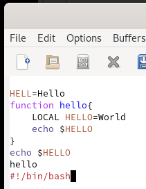
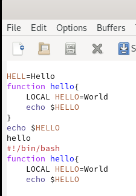
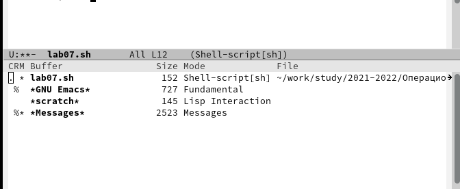
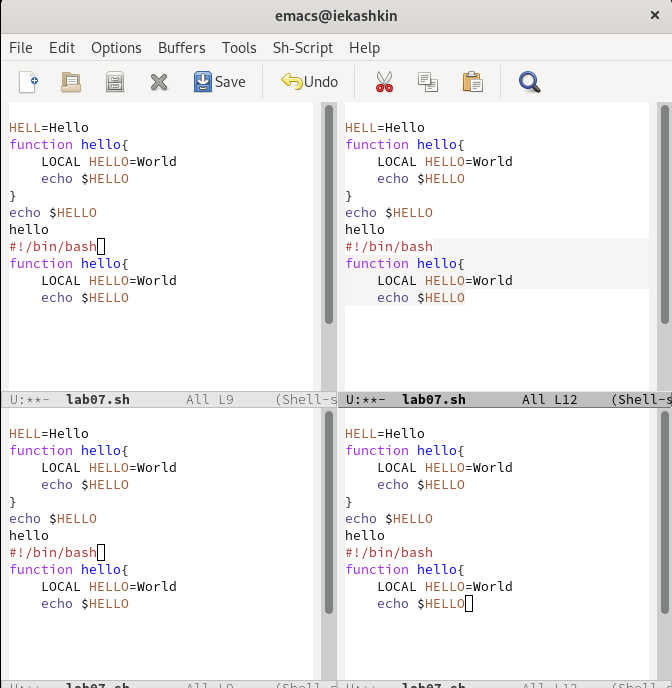
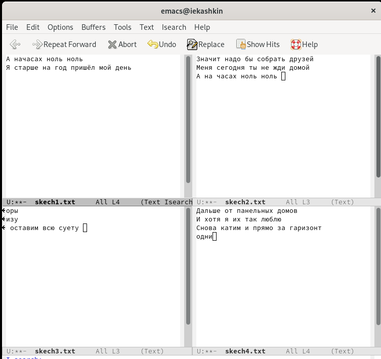

---
## Front matter
lang: ru-RU
title: Отчет по лабораторной работе №9
author: Кашкин Иван Евгеньевич
institute: РУДН, Москва, Россия
date: 21 мая 2022 г.

## Formatting
toc: false
slide_level: 2
theme: metropolis
header-includes: 
 - \metroset{progressbar=frametitle,sectionpage=progressbar,numbering=fraction}
 - '\makeatletter'
 - '\beamer@ignorenonframefalse'
 - '\makeatother'
aspectratio: 43
section-titles: true
---

## Цель работы 

Познакомиться с операционной системой Linux. Получить практические навыки работы с редактором Emacs

## Задание

1. Ознакомиться с теоретическим материалом.
2. Ознакомиться с редактором emacs.
3. Выполнить упражнения.
4. Ответить на контрольные вопросы

##Устонавил текстовый редактор emacs 

{ #fig:001 width=70% }

{ #fig:002 width=70% }

## Текст

Создал файл lab07.sh с помощью комбинации Ctrl-x Ctrl-f (C-x C-f) и набрал текст. Сохранил файл с помощью комбинации Ctrl-x Ctrl-s 

{ #fig:003 width=70% }

## Работа с программой 

Вырезал одной командой целую строку (С-k), вставил эту строку в конец файла (C-y), выделил область текста (C-space), скопировал область в буфер обмена (Alt-w), вставил область в конец файла, вновь выделил эту область и на этот раз вырезал её (C-w), отменил последнее действие (C-/) 
  
{ #fig:004 width=70% }

##

{ #fig:005 width=70% }

## Рбота с буферами 

Вывел список активных буферов на экран (C-x C-b), переместил во вновь открытое окно (C-x) o со списком открытых буферов и переключитесь на другой буфер, закрыл это окно (C-x 0)

{ #fig:006 width=70% }

##

{ #fig:007 width=70% }

{ #fig:008 width=70% }

##

{ #fig:009 width=70% }

## Вывод

Познакомился с операционной системой Linux. Получил практические навыки работы с редактором Emacs

## {.standout}

Спасибо за внимание!
