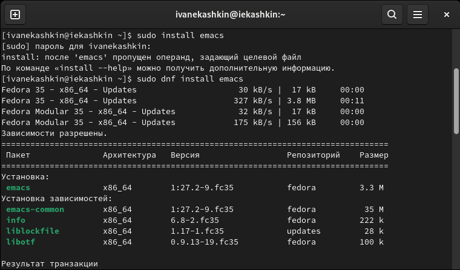
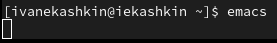
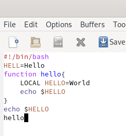
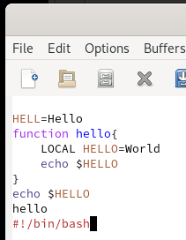
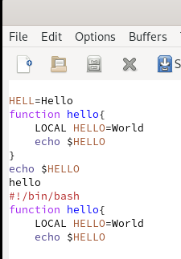
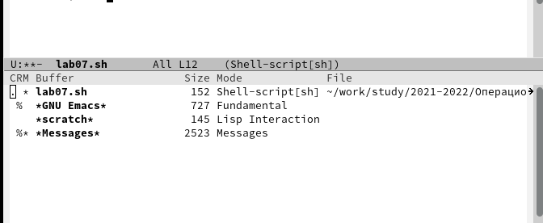
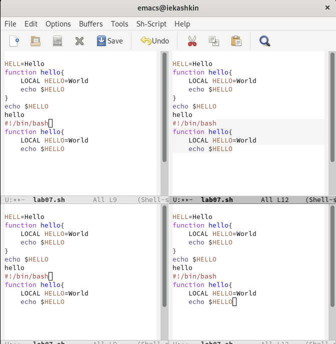
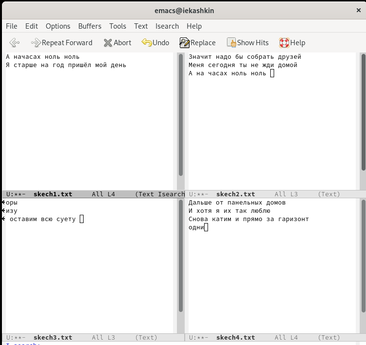
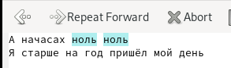

---
## Front matter
title: "Oтчет по лабораторной работе №9"
subtitle: "Дисциплина: Операционные системы"
author: "Кашкин Иввн Евгеньевич"

## Generic otions
lang: ru-RU
toc-title: "Содержание"

## Bibliography
bibliography: bib/cite.bib
csl: pandoc/csl/gost-r-7-0-5-2008-numeric.csl

## Pdf output format
toc: true # Table of contents
toc-depth: 2
lof: true # List of figures
lot: true # List of tables
fontsize: 12pt
linestretch: 1.5
papersize: a4
documentclass: scrreprt
## I18n polyglossia
polyglossia-lang:
  name: russian
  options:
	- spelling=modern
	- babelshorthands=true
polyglossia-otherlangs:
  name: english
## I18n babel
babel-lang: russian
babel-otherlangs: english
## Fonts
mainfont: PT Serif
romanfont: PT Serif
sansfont: PT Sans
monofont: PT Mono
mainfontoptions: Ligatures=TeX
romanfontoptions: Ligatures=TeX
sansfontoptions: Ligatures=TeX,Scale=MatchLowercase
monofontoptions: Scale=MatchLowercase,Scale=0.9
## Biblatex
biblatex: true
biblio-style: "gost-numeric"
biblatexoptions:
  - parentracker=true
  - backend=biber
  - hyperref=auto
  - language=auto
  - autolang=other*
  - citestyle=gost-numeric
## Pandoc-crossref LaTeX customization
figureTitle: "Рис."
tableTitle: "Таблица"
listingTitle: "Листинг"
lofTitle: "Список иллюстраций"
lotTitle: "Список таблиц"
lolTitle: "Листинги"
## Misc options
indent: true
header-includes:
  - \usepackage{indentfirst}
  - \usepackage{float} # keep figures where there are in the text
  - \floatplacement{figure}{H} # keep figures where there are in the text
---

# Цель работы

- Познакомиться с операционной системой Linux. Получить практические навыки работы с редактором Emacs

# Задание

1. Ознакомиться с теоретическим материалом.
2. Ознакомиться с редактором emacs.
3. Выполнить упражнения.
4. Ответить на контрольные вопросы

# Теоретическое введение

**Основные термины Emacs**
- Определение 1. Буфер — объект, представляющий какой-либо текст. Буфер может содержать что угодно, например, результаты компиляции программы или встроенные подсказки. Практически всё взаимодействие с пользователем, в том
числе интерактивное, происходит посредством буферов.
- Определение 2. Фрейм соответствует окну в обычном понимании этого слова. Каждый фрейм содержит область вывода и одно или несколько окон Emacs.
- Определение 3. Окно — прямоугольная область фрейма, отображающая один из буферов. Каждое окно имеет свою строку состояния, в которой выводится следующая информация: название буфера, его основной режим, изменялся ли текст буфера и как далеко вниз по буферу расположен курсор. Каждый буфер находится только в одном из возможных основных режимов. Существующие основные режимы включают режим Fundamental (наименее специализированный), режим Text, режим Lisp, режим С, режим Texinfo и другие. Под второстепенными режимами понимается список режимов, которые включены в данный момент в буфере выбранного окна.
- Определение 4. Область вывода — одна или несколько строк внизу фрейма, в которой Emacs выводит различные сообщения, а также запрашивает подтверждения и дополнительную информацию от пользовател

# Выполнение лабораторной работы

- 1) Устонавил текстовый редактор emacs (рис. [-@fig:001])

{ #fig:001 width=70% }

- 2) Открываем emacs через терминал (рис. [-@fig:002])

{ #fig:002 width=70% }

- 3) Создал файл lab07.sh с помощью комбинации Ctrl-x Ctrl-f (C-x C-f) и набрал текст (рис. [-@fig:003])

{ #fig:003 width=70% }

- Сохранил файл с помощью комбинации Ctrl-x Ctrl-s 

- 4) Вырезал одной командой целую строку (С-k), вставил эту строку в конец файла (C-y), выделил область текста (C-space), скопировал область в буфер обмена (Alt-w), вставил область в конец файла, вновь выделил эту область и на этот раз вырезал её (C-w), отменил последнее действие (C-/) (рис. [-@fig:004])
  
{ #fig:004 width=70% }

- 4) Переместил курсор в начало строки (C-a), переместил курсор в конец строки (C-e), переместил курсор в начало буфера (M-<), переместите курсор в конец буфера (M->). (рис. [-@fig:005])

{ #fig:005 width=70% }

- 5) Вывел список активных буферов на экран (C-x C-b), переместил во вновь открытое окно (C-x) o со списком открытых буферов и переключитесь на другой буфер, закрыл это окно (C-x 0), снова переключился между буферами, но уже без вывода их списка на экран (C-x b)(рис. [-@fig:006]) 

{ #fig:006 width=70% }

- 6) Поделил фрейм на 4 части: разделите фрейм на два окна по вертикали (C-x 3), а затем каждое из этих окон на две части по горизонтали (C-x 2) (рис. [-@fig:007]) В каждом из четырёх созданных окон открыл новый буфер (файл) и ввел несколько строк текста.(рис. [-@fig:008])

{ #fig:007 width=70% }

{ #fig:008 width=70% }

- 7) Переключился в режим поиска (C-s) и найшел несколько слов, присутствующих в тексте, переключался между результатами поиска, нажимая C-s, вышел из режима поиска, нажав C-g, перешел в режим поиска и замены (M-%), ввел текст, который следует найти
и заменит, а затем заменил его на другой. Подтвердил замену "!". Попробывал другой режим поиска, нажав M-s o. (рис. [-@fig:009]) (рис. [-@fig:0010])

{ #fig:009 width=70% }

{ #fig:0010 width=70% }

# Выводы

- Познакомился с операционной системой Linux. Получил практические навыки работы с редактором Emacs

# Контрольные вопросы

1. Emacs один из наиболее мощных и широко распространённых редакторов, используемых в мире Unix. По популярности он соперничает с редактором vi и его клонами. В зависимости от ситуации, Emacs может быть:

    текстовым редактором;
    программой для чтения почты и новостей Usenet;
    интегрированной средой разработки (IDE);
    операционной системой и т.д.
    Всё это разнообразие достигается благодаря архитектуре Emacs, которая позволяет расширять возможности редактора при помощи языка Emacs Lisp. На языке C написаны лишь самые базовые и низкоуровневые части Emacs, включая полнофункциональныйинтерпретатор языка Lisp. Таким образом, Emacs имеет встроенный язык программирования, который может использоваться для настройки, расширения и изменения поведения редактора. В действительности, большая часть того редактора, с которым пользователи Emacs работают в наши дни, написана на языке Lisp.

2. Основную трудность для новичков при освоении данного редактора могут составлять большое количество команд, комбинаций клавиш, которые не получится все запомнить с первого раза и поэтоу придется часто обращаться к справочным материалам.
3. Буфер это объект, представляющий собой текст. Если имеется несколько буферов, то редактировать можно только один. Обычно буфер считывает данные из файла или записывает в файл данные из буфера. Окно это область экрана, отображающая буфер. При запуске редактора отображается одно окно, но при обращении к некоторым функциям могут открыться дополнительные окна. Окна Emacs и окна графической среды X Window разные вещи. Одно окно X Window может быть разбито на несколько окон в смысле Emacs, в каждом из которых отображается отдельный буфер.
4. Да, можно.
5. При запуске Emacs по умолчанию создаются следующие буферы:
   - «scratch» (буфер для несохраненного текста)
   - «Messages» (журнал ошибок, включающий также информацию, которая появляется в области EchoArea)
   - «GNU Emacs» (справочный буфер о редакторе)

6. C-c | сначала, удерживая «ctrl», нажимаю «c», после отпускаю обе клавиши и нажимаю «|»
C-c C-| сначала, удерживая «ctrl», нажимаю «с», после отпускаю обе клавиши и, удерживая «ctrl», нажимаю «|»
7. Чтобы поделить окно на две части необходимо воспользоваться комбинацией «Ctrl-x 3» (по вертикали) или «Ctrl-x 2» (по горизонтали).
8. Настройки Emacs хранятся в файле .emacs.
9. По умолчанию клавиша «Backspace» удаляет символ перед курсором, но в редакторе её можно переназначить. Для этого необхдимо изменить конфигурацию файла .emacs.
10. Более удобным я считаю редактор emacs, потому что в нем проще открывать другие файлы, можно использовать сразу несколько окон, нет «Командного режима», «Режима ввода», «Режима командной строки», которые являются немного непривычными и в какой то степени неудобными.

# Список литературы{.unnumbered}

::: {#Лабораторная работа No 9. Текстовой редактор emacs}
:::
