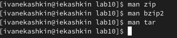
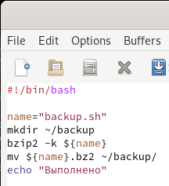
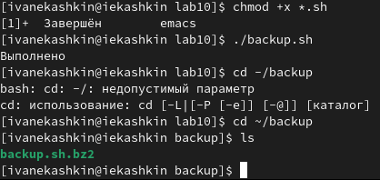
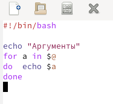
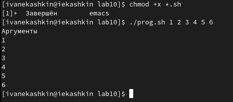
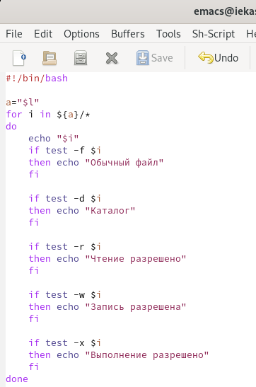
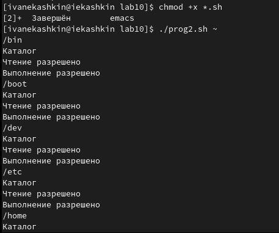
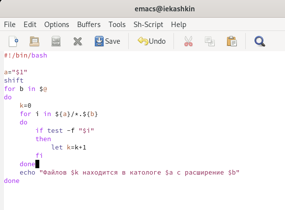
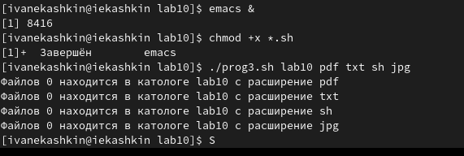

---
## Front matter
lang: ru-RU
title: Отчет по лабораторной работе №10
author: Кашкин Иван Евгеньевич
institute: РУДН, Москва, Россия
date: 21 мая 2022 г.

## Formatting
toc: false
slide_level: 2
theme: metropolis
header-includes: 
 - \metroset{progressbar=frametitle,sectionpage=progressbar,numbering=fraction}
 - '\makeatletter'
 - '\beamer@ignorenonframefalse'
 - '\makeatother'
aspectratio: 43
section-titles: true
---

## Цель работы 

Изучить основы программирования в оболочке ОС UNIX/Linux. Научиться писать небольшие командные файлы

## Задание

Прописать 4 скрипта заданных в лабораторной работе

## Начало 

Сначала с помощью команды man изучил информацию о zip, bzip2, tar (рис. [-@fig:001])

{ #fig:001 width=70% }

## Первый скрипт, архивирования

{ #fig:006 width=70% }

{ #fig:007 width=70% }

## Второй скрипт, аргументы
  
{ #fig:008 width=70% }

{ #fig:009 width=70% }

## Третий скрипт, ls 

{ #fig:0010 width=70% }

{ #fig:0011 width=70% }

## Четвертый скрипт, подсчет

{ #fig:0012 width=70% }

{ #fig:0013 width=70% }

## Вывод

Изучил основы программирования в оболочке ОС UNIX/Linux. Научился писать небольшие командные файлы

## {.standout}

Спасибо за внимание!
