---
## Front matter
title: "Oтчет по лабораторной работе №11"
subtitle: "Дисциплина: Операционные системы"
author: "Кашкин Иввн Евгеньевич"

## Generic otions
lang: ru-RU
toc-title: "Содержание"

## Bibliography
bibliography: bib/cite.bib
csl: pandoc/csl/gost-r-7-0-5-2008-numeric.csl

## Pdf output format
toc: true # Table of contents
toc-depth: 2
lof: true # List of figures
lot: true # List of tables
fontsize: 12pt
linestretch: 1.5
papersize: a4
documentclass: scrreprt
## I18n polyglossia
polyglossia-lang:
  name: russian
  options:
	- spelling=modern
	- babelshorthands=true
polyglossia-otherlangs:
  name: english
## I18n babel
babel-lang: russian
babel-otherlangs: english
## Fonts
mainfont: PT Serif
romanfont: PT Serif
sansfont: PT Sans
monofont: PT Mono
mainfontoptions: Ligatures=TeX
romanfontoptions: Ligatures=TeX
sansfontoptions: Ligatures=TeX,Scale=MatchLowercase
monofontoptions: Scale=MatchLowercase,Scale=0.9
## Biblatex
biblatex: true
biblio-style: "gost-numeric"
biblatexoptions:
  - parentracker=true
  - backend=biber
  - hyperref=auto
  - language=auto
  - autolang=other*
  - citestyle=gost-numeric
## Pandoc-crossref LaTeX customization
figureTitle: "Рис."
tableTitle: "Таблица"
listingTitle: "Листинг"
lofTitle: "Список иллюстраций"
lotTitle: "Список таблиц"
lolTitle: "Листинги"
## Misc options
indent: true
header-includes:
  - \usepackage{indentfirst}
  - \usepackage{float} # keep figures where there are in the text
  - \floatplacement{figure}{H} # keep figures where there are in the text
---

# Цель работы

- Изучить основы программирования в оболочке ОС UNIX. Научится писать более сложные командные файлы с использованием логических управляющих конструкций и циклов.

# Задание
1. Используя команды getopts grep, написать командный файл, который анализирует командную строку с ключами:
- -iinputfile прочитать данные из указанного файла;
- -ooutputfile  вывести данные в указанный файл;
- -pшаблон  указать шаблон для поиска;
- -C  различать большие и малые буквы;
- -n  выдавать номера строк, а затем ищет в указанном файле нужные строки, определяемые ключом -p.
2. Написать на языке Си программу, которая вводит число и определяет, является ли оно больше нуля, меньше нуля или равно нулю. Затем программа завершается с помощью функции exit(n), передавая информацию в о коде завершения в оболочку. Командный файл должен вызывать эту программу и, проанализировав с помощью команды $?, выдать сообщение о том, какое число было введено.
3. Написать командный файл, создающий указанное число файлов, пронумерованных последовательно от 1 до N (например 1.tmp, 2.tmp, 3.tmp,4.tmp и т.д.). Число файлов, которые необходимо создать, передаётся в аргументы командной строки. Этот же командный файл должен уметь удалять все созданные им файлы (если они существуют).
4. Написать командный файл, который с помощью команды tar запаковывает в архив все файлы в указанной директории. Модифицировать его так, чтобы запаковывались только те файлы, которые были изменены менее недели тому назад (использовать
команду find).

# Теоретическое введение

- Командный процессор (командная оболочка, интерпретатор команд shell) — это программа, позволяющая пользователю взаимодействовать с операционной системой компьютера. В операционных системах типа UNIX/Linux наиболее часто используются следующие реализации командных оболочек:
 - оболочка Борна (Bourne shell или sh) — стандартная командная оболочка UNIX/Linux, содержащая базовый, но при этом полный набор функций;
 - С-оболочка (или csh) — надстройка на оболочкой Борна, использующая С-подобный синтаксис команд с возможностью сохранения истории выполнения команд;
 - оболочка Корна (или ksh) — напоминает оболочку С, но операторы управления программой совместимы с операторами оболочки Борна;
 - BASH — сокращение от Bourne Again Shell (опять оболочка Борна), в основе своей сов-
мещает свойства оболочек С и Корна (разработка компании Free Software Foundation).
POSIX (Portable Operating System Interface for Computer Environments) — набор стандартов
описания интерфейсов взаимодействия операционной системы и прикладных программ.
Стандарты POSIX разработаны комитетом IEEE (Institute of Electrical and Electronics
Engineers) для обеспечения совместимости различных UNIX/Linux-подобных операционных систем и переносимости прикладных программ на уровне исходного кода.
POSIX-совместимые оболочки разработаны на базе оболочки Корна.
Рассмотрим основные элементы программирования в оболочке bash. В других оболочках большинство команд будет совпадать с описанными ниже.

# Выполнение лабораторной работы
 
1. Зашёл в каталог лабораторной работы, создал файл 1 программы и открыл emacs (рис. [-@fig:001])

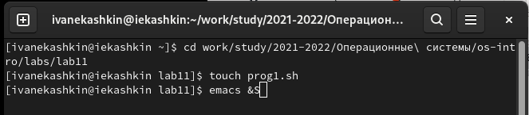{ #fig:001 width=70% }

- Используя команды getopts grep, написал командный файл, который анализирует командную строку с ключами (рис. [-@fig:002]) (рис. [-@fig:003])

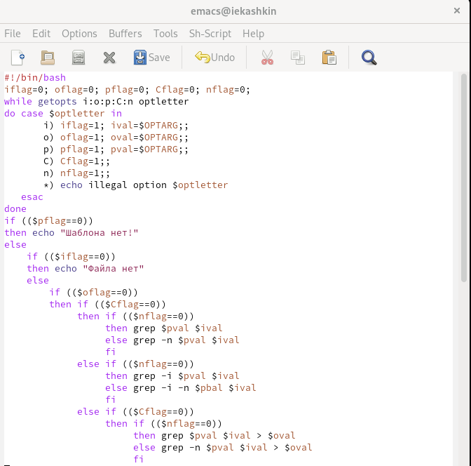{ #fig:002 width=70% }

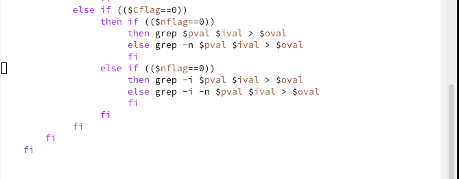{ #fig:003 width=70% }

- Далее сохранил файл и запустил его из командной строки, предворительно создав файл 1.txt и 2.txt. После прописываем команду "./prog1.sh ..." и добавляем маркеры для провеки файла. (рис. [-@fig:004])

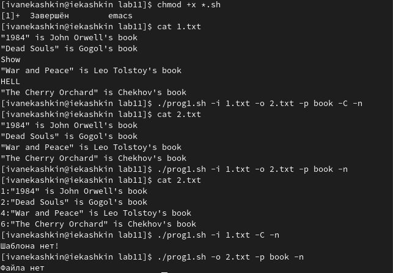{ #fig:004 width=70% }

2. Создал файлы для второй программы prog2.c и prog2.sh (рис. [-@fig:005])

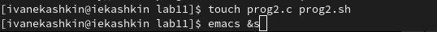{ #fig:005 width=70% }

- Написал на языке Си программу, которая вводит число и определяет, является ли оно больше нуля, меньше нуля или равно нулю.
- Прописываю текст программы для файла Си (рис. [-@fig:006])
- После написал программу для файла .sh (рис. [-@fig:007])
 
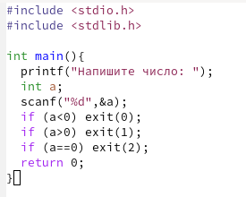{ #fig:006 width=70% }

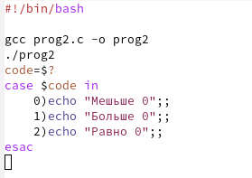{ #fig:007 width=70% }

- Делаее я я проверил работы программы, запустив ее из терминала "./prog2.sh" (рис. [-@fig:008])

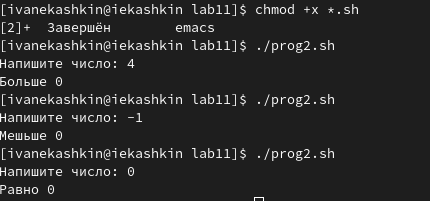{ #fig:008 width=70% }

3. Создал файлы для третьей программы prog3.sh (рис. [-@fig:009]) 

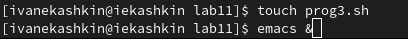{ #fig:009 width=70% }

- Написал командный файл, создающий указанное число файлов, пронумерованных последовательно от 1 до N. Этот командный файл также удаляет все созданные им файлы. (рис. [-@fig:0010])

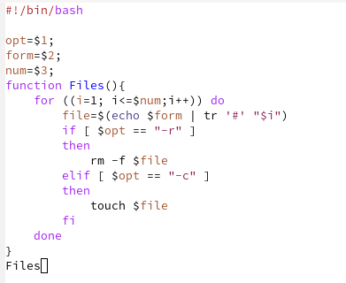{ #fig:0010 width=70% }

- Я сохранил командный файл, проверил содержимое дериктории командой "ls", после создал файлы командой "./prog3.sh -c w#.txt 4" и удалил командой "./prog3.sh -r w#.txt 4" (рис. [-@fig:0011])

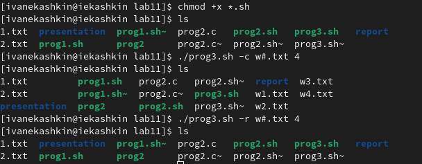{ #fig:0011 width=70% }

4. Создал файлы для программы prog4.sh (рис. [-@fig:0012]) 

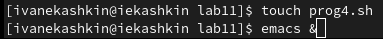{ #fig:0012 width=70% }

- Написал командный файл, который с помощью команды tar запаковывает в архив все файлы в указанной директории. (рис. [-@fig:0013])

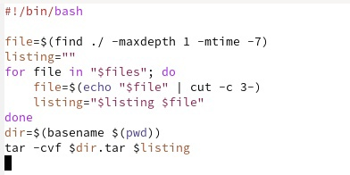{ #fig:0013 width=70% }

- Далее проверил дерикторию командой "ls" и использовал командный файл с помощью двух команд "./prog4.sh" и "./tar -tf lab11.tar"(рис. [-@fig:0014]) 

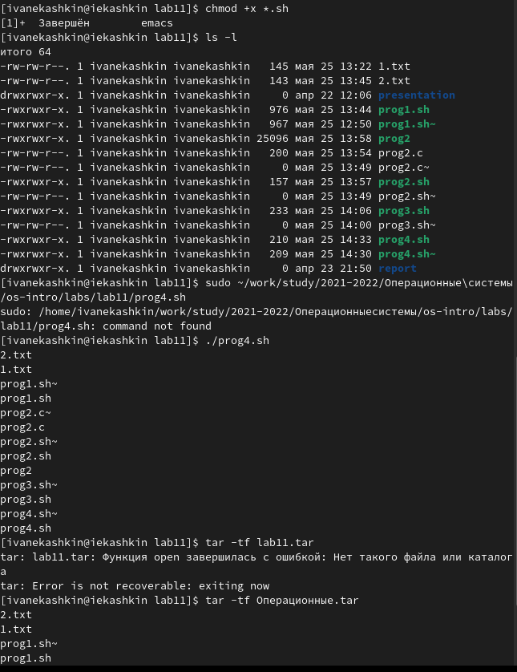{ #fig:0014 width=70% }

# Выводы

- Изучил основы программирования в оболочке ОС UNIX. Научился писать более сложные командные файлы с использованием логических управляющих конструкций и циклов.

# Контрольные вопросы

1. Команда getopts осуществляет синтаксический анализ командной строки, выделяя флаги, и используется для объявления переменных. Синтаксис команды следующий: 
getopts option string variable [arg ... ] 
Флаги − это опции командной строки, обычно помеченные знаком минус; Например, для команды ls флагом может являться F. 
Строка опций option string  это список возможных букв и чисел соответствующего флага. Если ожидается, что некоторый флаг будет сопровождаться некоторым аргументом, то за символом, обозначающим этот флаг, должно следовать двоеточие. Соответствующей переменной присваивается буква данной опции. Если команда getopts может распознать аргумент, то она возвращает истину. Принято включать getopts в цикл while и анализировать введённые данные с помощью оператора case. 
Функция getopts включает две специальные переменные среды − OPTARG и OPTIND. Если ожидается дополнительное значение, то OPTARG устанавливается в значение этого аргумента. 
Функция getopts также понимает переменные типа массив, следовательно, можно использовать её в функции не только для синтаксического анализа аргументов функций, но и для анализа введённых пользователем данных.
2. При перечислении имён файлов текущего каталога можно использовать следующие символы:
- * соответствует произвольной, в том числе и пустой строке;
- ? соответствует любому одинарному символу;
- [c1-c2] соответствует любому символу, лексикографически находящемуся между символами с1 и с2.
Например, 
- echo * выведет имена всех файлов текущего каталога, что представляет собой простейший аналог команды ls;
- ls *.c выведет все файлы с последними двумя символами, совпадающими с .c.
- echo prog.? выведет все файлы, состоящие из пяти или шести символов, первыми пятью символами которых являются prog..
- [a-z]* соответствует произвольному имени файла в текущем каталоге, начинающемуся с любой строчной буквы латинского алфавита.
3. Часто бывает необходимо обеспечить проведение каких-либо действий циклически и управление дальнейшими действиями в зависимости отрезультатов проверки некоторого условия. Для решения подобных задач язык программирования bash предоставляет возможность использовать такие управляющие конструкции, как for, case, if и while. С точки зрения командного процессора эти управляющие конструкции являются обычными командами и могут использоваться как при создании командных файлов, так и при работе в интерактивном режиме. Команды, реализующие подобные конструкции, по сути, являются операторами языка программирования bash. Поэтому при описании языка программирования bash термин оператор будет использоваться наравне с термином команда. 
Команды ОС UNIX возвращают код завершения, значение которого может быть использовано для принятия решения о дальнейших действиях. Команда test, например, создана специально для использования в командных файлах. Единственная функция этой команды заключается в выработке кода завершения.
4. Два несложных способа позволяют вам прерывать циклы в оболочке bash. 
Команда break завершает выполнение цикла, а команда continue завершает данную итерацию блока операторов. 
Команда break полезна для завершения цикла while в ситуациях, когда условие перестаёт быть правильным. 
Команда continue используется в ситуациях, когда больше нет необходимости выполнять блок операторов, но вы можете захотеть продолжить проверять данный блок на других условных выражениях.
5. Следующие две команды ОС UNIX используются только совместно с управляющими конструкциями языка программирования bash: это команда true, которая всегда возвращает код завершения, равный нулю (т.е. истина), и команда false, которая всегда возвращает код завершения, не равный нулю (т. е. ложь). 
Примеры бесконечных циклов: 
while true 
do echo hello andy 
done 
until false 
do echo hello mike 
done
6. Строка if test f man$s/$i.$s проверяет, существует ли файл man$s/$i.$s и является ли этот файл обычным файлом. Если данный файл является каталогом, то команда вернет нулевое значение (ложь).
7. Выполнение оператора цикла while сводится к тому, что сначала выполняется последовательность команд (операторов), которую задаёт список команд в строке, содержащей служебное слово while, а затем, если последняя выполненная команда из этой последовательности команд возвращает нулевой код завершения (истина), выполняется последовательность команд (операторов), которую задаёт список-команд в строке, содержащей служебное слово do, после чего осуществляется безусловный переход на начало оператора цикла while. Выход из цикла будет осуществлён тогда, когда последняя выполненная команда из последовательности команд (операторов), которую задаёт список-команд в строке, содержащей служебное слово while, возвратит ненулевой код завершения (ложь). 
При замене в операторе цикла while служебного слова while на until условие, при выполнении которого осуществляется выход из цикла, меняется на противоположное. В остальном оператор цикла while и оператор цикла until идентичны.

# Список литературы{.unnumbered}

::: {#Лабораторная работа No 10. Программирование в командном процессоре ОС UNIX. Командные файлы}
:::
