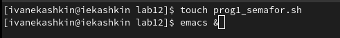
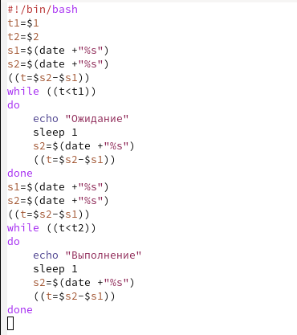
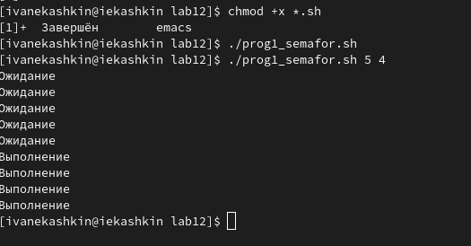
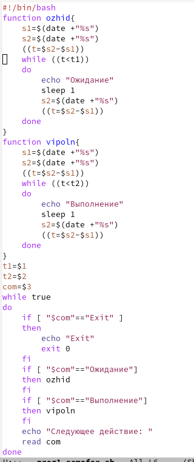
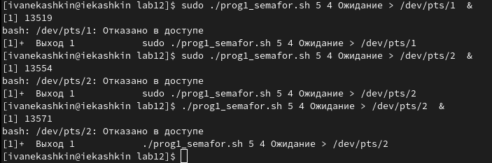
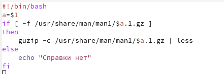
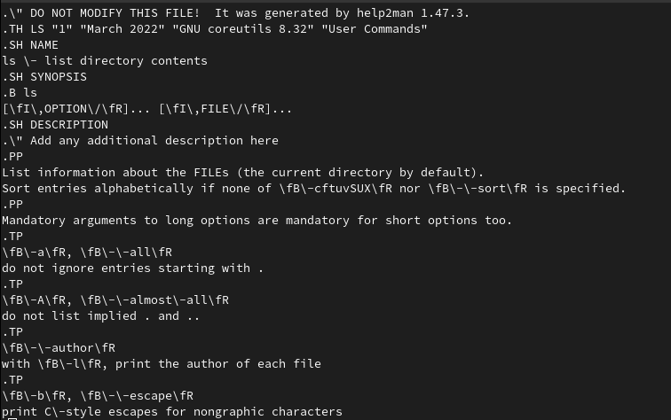
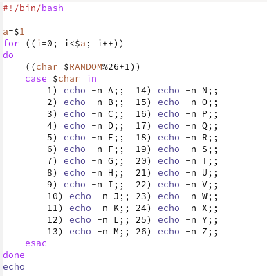

---
## Front matter
lang: ru-RU
title: Отчет по лабораторной работе №12
author: Кашкин Иван Евгеньевич
institute: РУДН, Москва, Россия
date: 28 мая 2022 г.

## Formatting
toc: false
slide_level: 2
theme: metropolis
header-includes: 
 - \metroset{progressbar=frametitle,sectionpage=progressbar,numbering=fraction}
 - '\makeatletter'
 - '\beamer@ignorenonframefalse'
 - '\makeatother'
aspectratio: 43
section-titles: true
---

## Цель работы 

Изучить основы программирования в оболочке ОС UNIX. Научиться писать более сложные командные файлы с использованием логических управляющих конструкций и циклов

## Задание

Прописать 3 скрипта заданных в лабораторной работе

## Начало 

Сначала создаем файлы для скриптов и открываем эти файлы в emacs

{ #fig:001 width=70% }

## Первый скрипт

{ #fig:002 width=70% }

## 
  
{ #fig:003 width=70% }

## Модернизированный скрипт

{ #fig:004 width=70% }

##

{ #fig:005 width=70% }

## Второй скрипт

{ #fig:008 width=70% }

## 

{ #fig:009 width=70% }

## Третий скрипт

{ #fig:0012 width=70% }

## 

{ #fig:0013 width=70% }

## Вывод

Изучил основы программирования в оболочке ОС UNIX. Научился писать более сложные командные файлы с использованием логических управляющих конструкций и циклов

## {.standout}

Спасибо за внимание!
