---
## Front matter
title: "Oтчет по лабораторной работе №12"
subtitle: "Дисциплина: Операционные системы"
author: "Кашкин Иввн Евгеньевич"

## Generic otions
lang: ru-RU
toc-title: "Содержание"

## Bibliography
bibliography: bib/cite.bib
csl: pandoc/csl/gost-r-7-0-5-2008-numeric.csl

## Pdf output format
toc: true # Table of contents
toc-depth: 2
lof: true # List of figures
lot: true # List of tables
fontsize: 12pt
linestretch: 1.5
papersize: a4
documentclass: scrreprt
## I18n polyglossia
polyglossia-lang:
  name: russian
  options:
	- spelling=modern
	- babelshorthands=true
polyglossia-otherlangs:
  name: english
## I18n babel
babel-lang: russian
babel-otherlangs: english
## Fonts
mainfont: PT Serif
romanfont: PT Serif
sansfont: PT Sans
monofont: PT Mono
mainfontoptions: Ligatures=TeX
romanfontoptions: Ligatures=TeX
sansfontoptions: Ligatures=TeX,Scale=MatchLowercase
monofontoptions: Scale=MatchLowercase,Scale=0.9
## Biblatex
biblatex: true
biblio-style: "gost-numeric"
biblatexoptions:
  - parentracker=true
  - backend=biber
  - hyperref=auto
  - language=auto
  - autolang=other*
  - citestyle=gost-numeric
## Pandoc-crossref LaTeX customization
figureTitle: "Рис."
tableTitle: "Таблица"
listingTitle: "Листинг"
lofTitle: "Список иллюстраций"
lotTitle: "Список таблиц"
lolTitle: "Листинги"
## Misc options
indent: true
header-includes:
  - \usepackage{indentfirst}
  - \usepackage{float} # keep figures where there are in the text
  - \floatplacement{figure}{H} # keep figures where there are in the text
---

# Цель работы

- Изучить основы программирования в оболочке ОС UNIX. Научиться писать более сложные командные файлы с использованием логических управляющих конструкций и циклов

# Задание
1. Написать командный файл, реализующий упрощённый механизм семафоров. Командный файл должен в течение некоторого времени t1 дожидаться освобождения ресурса, выдавая об этом сообщение, а дождавшись его освобождения, использовать его в течение некоторого времени t2<>t1, также выдавая информацию о том, что ресурс используется соответствующим командным файлом (процессом). Запустить командный файл в одном виртуальном терминале в фоновом режиме, перенаправив его вывод в другой (> /dev/tty#, где # — номер терминала куда перенаправляется вывод), в котором также запущен этот файл, но не фоновом, а в привилегированном режиме. Доработать программу так, чтобы имелась возможность взаимодействия трёх и более процессов.
2. Реализовать команду man с помощью командного файла. Изучите содержимое каталога /usr/share/man/man1. В нем находятся архивы текстовых файлов, содержащих справку по большинству установленных в системе программ и команд. Каждый архив можно открыть командой less сразу же просмотрев содержимое справки. Командный файл должен получать в виде аргумента командной строки название команды и в виде результата выдавать справку об этой команде или сообщение об отсутствии справки, если соответствующего файла нет в каталоге man1.
3. Используя встроенную переменную $RANDOM, напишите командный файл, генерирующий случайную последовательность букв латинского алфавита. Учтите, что $RANDOM выдаёт псевдослучайные числа в диапазоне от 0 до 32767.

# Теоретическое введение

- Командный процессор (командная оболочка, интерпретатор команд shell) — это программа, позволяющая пользователю взаимодействовать с операционной системой компьютера. В операционных системах типа UNIX/Linux наиболее часто используются следующие реализации командных оболочек:
 - оболочка Борна (Bourne shell или sh) — стандартная командная оболочка UNIX/Linux, содержащая базовый, но при этом полный набор функций;
 - С-оболочка (или csh) — надстройка на оболочкой Борна, использующая С-подобный синтаксис команд с возможностью сохранения истории выполнения команд;
 - оболочка Корна (или ksh) — напоминает оболочку С, но операторы управления программой совместимы с операторами оболочки Борна;
 - BASH — сокращение от Bourne Again Shell (опять оболочка Борна), в основе своей сов-
мещает свойства оболочек С и Корна (разработка компании Free Software Foundation).
POSIX (Portable Operating System Interface for Computer Environments) — набор стандартов
описания интерфейсов взаимодействия операционной системы и прикладных программ.
Стандарты POSIX разработаны комитетом IEEE (Institute of Electrical and Electronics
Engineers) для обеспечения совместимости различных UNIX/Linux-подобных операционных систем и переносимости прикладных программ на уровне исходного кода.
POSIX-совместимые оболочки разработаны на базе оболочки Корна.
Рассмотрим основные элементы программирования в оболочке bash. В других оболочках большинство команд будет совпадать с описанными ниже.

# Выполнение лабораторной работы
 
1. Зашёл в каталог лабораторной работы, создал файл 1 программы prog1_semafor.sh и открыл emacs (рис. [-@fig:001])

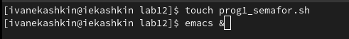{ #fig:001 width=70% }

- Написал командный файл, реализующий упрощённый механизм семафоров. (рис. [-@fig:002]) 

{ #fig:002 width=70% }

- Далее сохранил файл и запустил его из командной строки. Прописываем команду "./prog1_semafor.sh 5 4" и наблюдаем выполнение программы (рис. [-@fig:003])

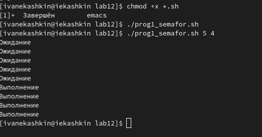{ #fig:004 width=70% }

- После модернизируем командный файл по заданию, чтобы имелась возможность взаимодействия трёх и более процессов.(рис. [-@fig:004])

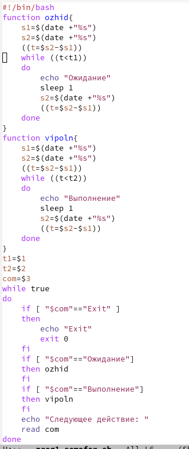{ #fig:004 width=70% }

- Далее сохранил файл и запустил его из командной строки. Прописываем команду "./prog1_semafor.sh 5 4" и наблюдаем выполнение программы (рис. [-@fig:005])

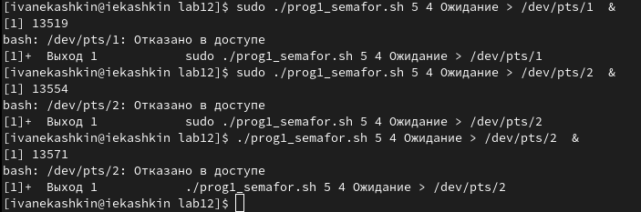{ #fig:005 width=70% }

2. По заднию мы просматриваем каталог /usr/share/man/man1 (рис. [-@fig:005])

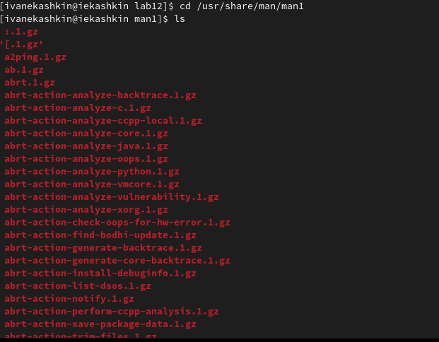{ #fig:006 width=70% }

- Создал файлы для второй программы prog2_man.sh (рис. [-@fig:007]) 

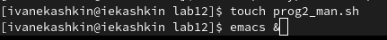{ #fig:007 width=70% }

- После написал программу для файла .sh (рис. [-@fig:008])

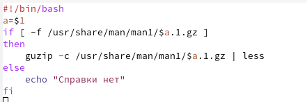{ #fig:008 width=70% }

- Делаее я проверил работы программы, запустив ее из терминала "./prog2_man.sh ls" (рис. [-@fig:009]) (рис. [-@fig:0010])

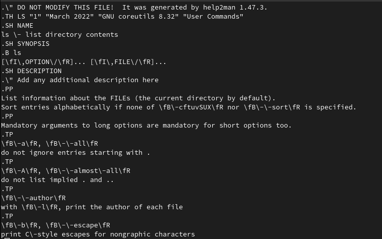{ #fig:009 width=70% }

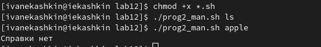{ #fig:0010 width=70% }

3. Создал файлы для третьей программы prog3_random.sh (рис. [-@fig:0011]) 

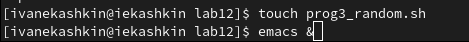{ #fig:0011 width=70% }

- Используя встроенную переменную $RANDOM, написал командный файл, генерирующий случайную последовательность букв латинского алфавита. (рис. [-@fig:0012])

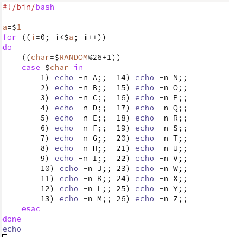{ #fig:0012 width=70% }

- Я сохранил командный файл и использовал его командой  (рис. [-@fig:0011])

{ #fig:0013 width=70% }

# Выводы

- Изучил основы программирования в оболочке ОС UNIX. Научился писать более сложные командные файлы с использованием логических управляющих конструкций и циклов

# Контрольные вопросы

1. while [$1 != "exit"] 
В данной строчке допущены следующие ошибки:
- не хватает пробелов после первой скобки [ и перед второй скобкой ]
- выражение $1 необходимо взять в “”, потому что эта переменная может содержать пробелы 
Таким образом, правильный вариант должен выглядеть так: 
while [ “$1” != "exit" ]
2. Чтобы объединить несколько строк в одну, можно воспользоваться несколькими способами:
- Первый: 
VAR1="Hello," 
VAR2=" World" 
VAR3="$VAR1$VAR2" 
echo "$VAR3" 
Результат: Hello, World
- Второй: 
VAR1="Hello, " 
VAR1+=" World" 
echo "$VAR1" 
Результат: Hello, World
3. Команда seq в Linux используется для генерации чисел от ПЕРВОГО до ПОСЛЕДНЕГО шага INCREMENT. 
Параметры:
- seq LAST: если задан только один аргумент, он создает числа от 1 до LAST с шагом шага, равным 1. Если LAST меньше 1, значение is не выдает.
- seq FIRST LAST: когда заданы два аргумента, он генерирует числа от FIRST до LAST с шагом 1, равным 1. Если LAST меньше FIRST, он не выдает никаких выходных данных.
- seq FIRST INCREMENT LAST: когда заданы три аргумента, он генерирует числа от FIRST до LAST на шаге INCREMENT. Если LAST меньше, чем FIRST, он не производит вывод.
- seq -f «FORMAT» FIRST INCREMENT LAST: эта команда используется для генерации последовательности в форматированном виде. FIRST и INCREMENT являются необязательными.
- seq -s «STRING» ПЕРВЫЙ ВКЛЮЧЕНО: Эта команда используется для STRING для разделения чисел. По умолчанию это значение равно /n. FIRST и INCREMENT являются необязательными.
- seq -w FIRST INCREMENT LAST: эта команда используется для выравнивания ширины путем заполнения начальными нулями. FIRST и INCREMENT являются необязательными.
4. Результатом данного выражения $((10/3)) будет 3, потому что это целочисленное деление без остатка.
5. Отличия командной оболочки zsh от bash:
- В zsh более быстрое автодополнение для cd с помощью Тab
- В zsh существует калькулятор zcalc, способный выполнять вычисления внутри терминала
- В zsh поддерживаются числа с плавающей запятой
- В zsh поддерживаются структуры данных «хэш»
- В zsh поддерживается раскрытие полного пути на основенеполных данных
- В zsh поддерживается замена части пути
- В zsh есть возможность отображать разделенный экран, такой же как разделенный экран vim
6. for ((a=1; a <= LIMIT; a++)) синтаксис данной конструкции верен, потому что, используя двойные круглые скобки, можно не писать $ перед переменными ().
7. Преимущества скриптового языка bash:
- Один из самых распространенных и ставится по умолчанию в большинстве дистрибутивах Linux, MacOS
- Удобное перенаправление ввода/вывода
- Большое количество команд для работы с файловыми системами Linux
- Можно писать собственные скрипты, упрощающие работу в Linux 
Недостатки скриптового языка bash:
- Дополнительные библиотеки других языков позволяют выполнить больше действий
- Bash не является языков общего назначения
- Утилиты, при выполнении скрипта, запускают свои процессы, которые, в свою очередь, отражаются на быстроте выполнения этого скрипта
- Скрипты, написанные на bash, нельзя запустить на других операционных системах без дополнительных действий

# Список литературы{.unnumbered}

::: {#Лабораторная работа No 10. Программирование в командном процессоре ОС UNIX. Командные файлы}
:::
