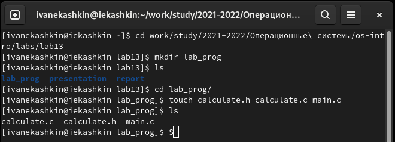
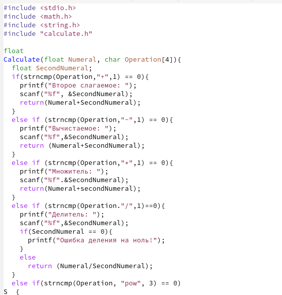
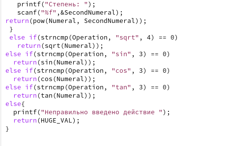
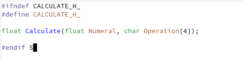
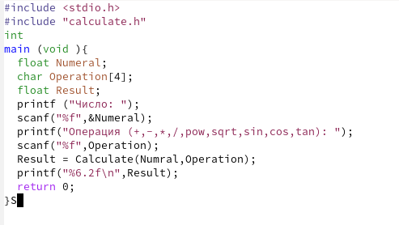
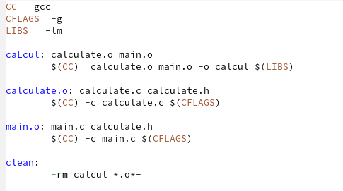
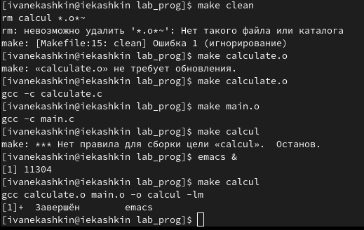
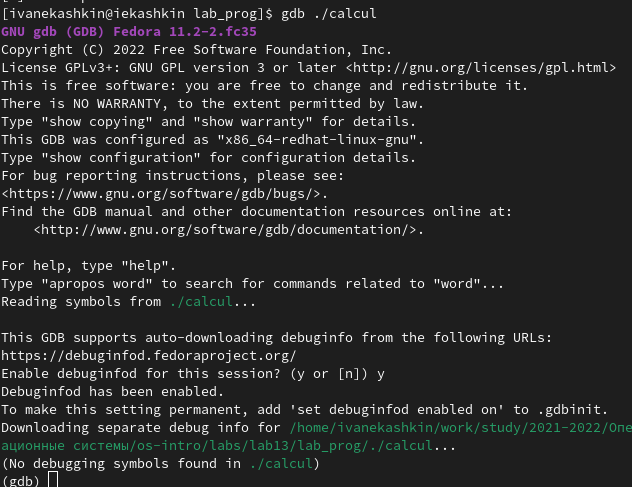

---
## Front matter
lang: ru-RU
title: Отчет по лабораторной работе №13
author: Кашкин Иван Евгеньевич
institute: РУДН, Москва, Россия
date: 4 июня 2022 г.

## Formatting
toc: false
slide_level: 2
theme: metropolis
header-includes: 
 - \metroset{progressbar=frametitle,sectionpage=progressbar,numbering=fraction}
 - '\makeatletter'
 - '\beamer@ignorenonframefalse'
 - '\makeatother'
aspectratio: 43
section-titles: true
---

## Цель работы 

Приобрести простейшие навыки разработки, анализа, тестирования и отладки приложений в ОС типа UNIX/Linux на примере создания на языке программирования С калькулятора с простейшими функциями

## Задание

Выполнить задание описанные в работе

## Начало 

Зашёл в каталог лабораторной работы, создал попку для программ и создал сами программы (рис. [-@fig:001])

{ #fig:001 width=70% }

## calculate.с

{ #fig:002 width=70% }

{ #fig:004 width=70% }

## сalculate.h
  
{ #fig:004 width=70% }

## main.c

{ #fig:005 width=70% }

## Makefile

{ #fig:008 width=70% }

## Makefile

С помощью Makefile создал нужные файлы (рис. [-@fig:009])

{ #fig:009 width=70% }

## 

{ #fig:008 width=70% }

## Вывод

В ходе выполнения данной лабораторной работы я приобрёл простейшие навыки разработки, анализа, тестирования и отладки приложений в ОС типа UNIX/Linux на примере создания на языке программирования С калькулятора с простейшими функциями

## {.standout}

Спасибо за внимание!
