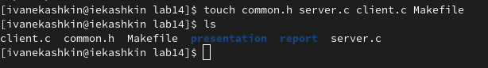
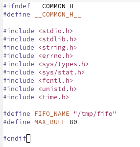
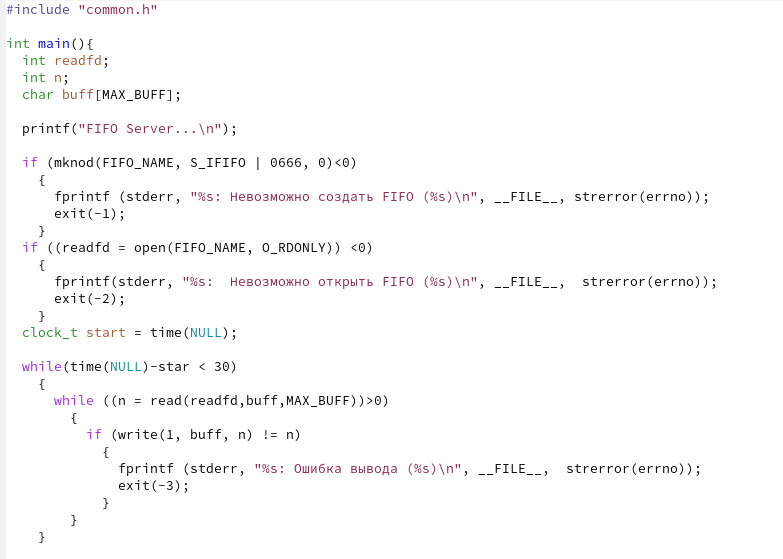
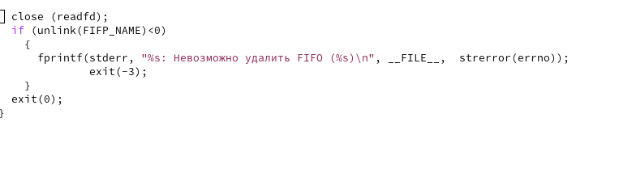
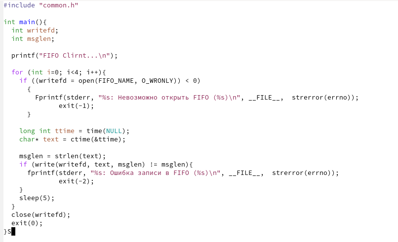
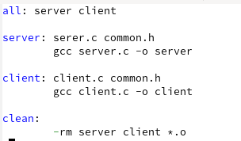
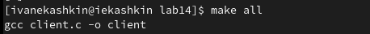
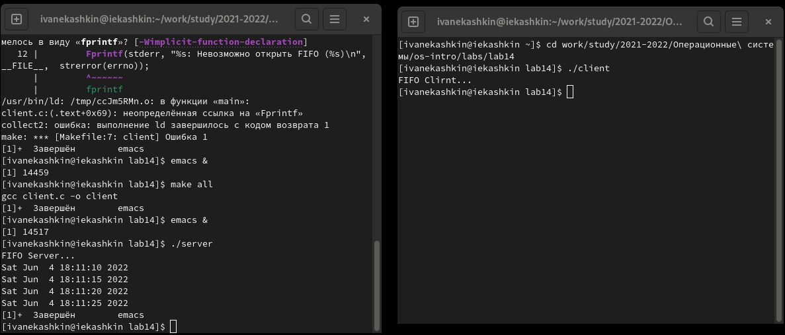

---
## Front matter
lang: ru-RU
title: Отчет по лабораторной работе №14
author: Кашкин Иван Евгеньевич
institute: РУДН, Москва, Россия
date: 4 июня 2022 г.

## Formatting
toc: false
slide_level: 2
theme: metropolis
header-includes: 
 - \metroset{progressbar=frametitle,sectionpage=progressbar,numbering=fraction}
 - '\makeatletter'
 - '\beamer@ignorenonframefalse'
 - '\makeatother'
aspectratio: 43
section-titles: true
---

## Цель работы 

Приобретение практических навыков работы с именованными каналами

## Задание

Выполнить задание описанные в работе

## Начало 

Зашёл в каталог лабораторной работы и создал сами программы (рис. [-@fig:001])

{ #fig:001 width=70% }

## common.h

{ #fig:002 width=70% }

## server.с
  
{ #fig:004 width=70% }

{ #fig:004 width=70% }

## client.c

Написал командный файл client.c (рис. [-@fig:005])

{ #fig:005 width=70% }

## Makefile

Создал Makefile (рис. [-@fig:006])

{ #fig:006 width=70% }

## Makefile

ССоздал с помошью Makefile нужные программы для работы (рис. [-@fig:007])

{ #fig:007 width=70% }

## 

Проверка выполнения скрипта (рис. [-@fig:008]) 

{ #fig:008 width=70% }

## Вывод

В ходе выполнения данной лабораторной работы я приобрёл практические навыки работы с именованными каналами.

## {.standout}

Спасибо за внимание!
