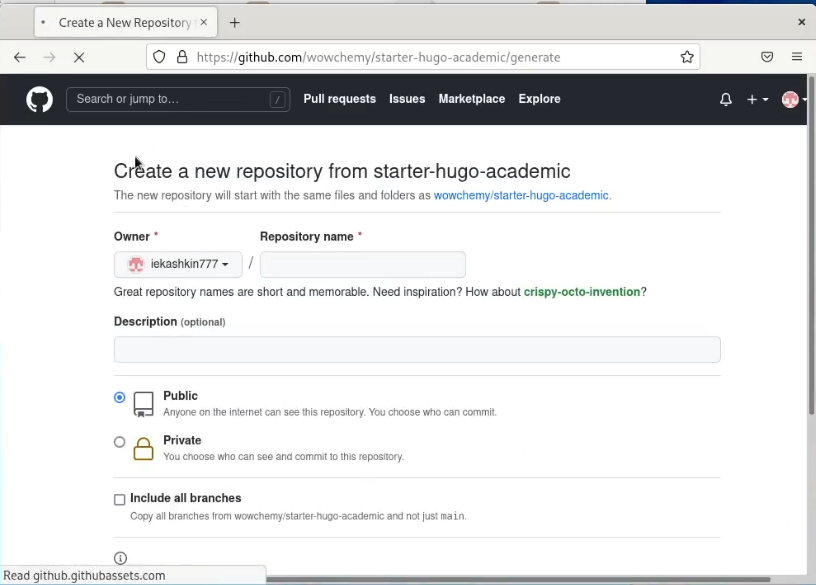
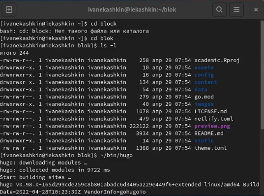
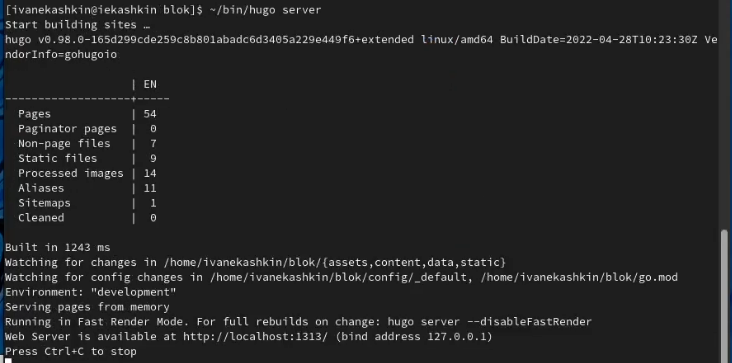
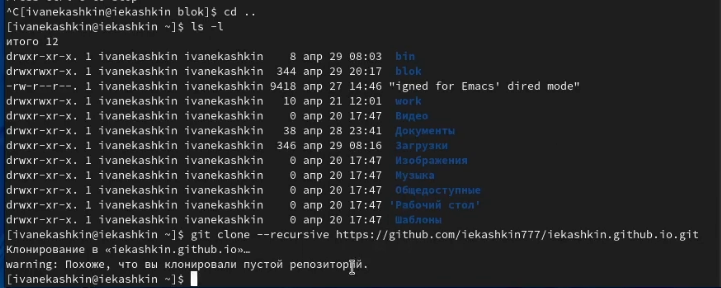
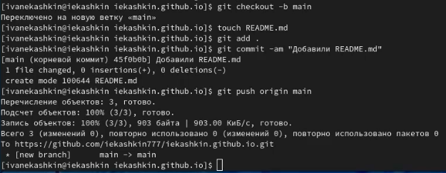
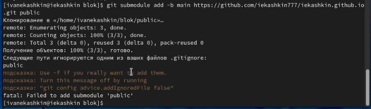
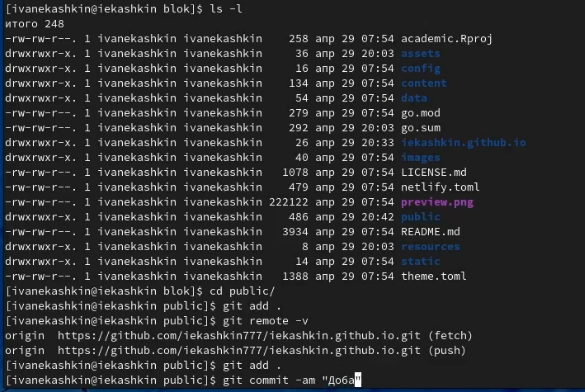

---
## Front matter
lang: ru-RU
title: Отчет по 1 этапу индивидуального проекта
author: Кашкин Иван Евгеньевич
institute: РУДН, Москва, Россия
date: 28 апреля 2022 г.

## Formatting
toc: false
slide_level: 2
theme: metropolis
header-includes: 
 - \metroset{progressbar=frametitle,sectionpage=progressbar,numbering=fraction}
 - '\makeatletter'
 - '\beamer@ignorenonframefalse'
 - '\makeatother'
aspectratio: 43
section-titles: true
---

## Цель работы 

Размещение на Github pages заготовки для персонального сайта.

## Задание

-Установить необходимое программное обеспечение.
-Скачать шаблон темы сайта.
-Разместить его на хостинге git.
-Установить параметр для URLs сайта.
-Разместить заготовку сайта на Github pages.

## Начало

Скачиваем исполнительный файл hugo. После создаем папку bin и переносим файл туда. Далее в Github создаем новй репозиторий. (рис. [-@fig:001])

{ #fig:001 width=70% }

## Команда hugo

Далее через терминал переходим в папку нового репозитория и прописываем команду "~/bin/hugo" (рис. [-@fig:002])

{ #fig:002 width=70% }

С помощью команды mc мы удаляем папку public

## Hugo server
  
 Далее прописываем команду "~/bin/hugo server" которая создает нам localhost. Переходим по ссылки и там будет инструкци, которая покажет, как истранить "демо". Нужно удалить файл demo.md(рис. [-@fig:004])

{ #fig:004 width=70% }

## Новый репозиторий 
  
Создаем новый репозиторий со своим ником, как в дисплейных классах. После клонируем его на нашу вертуальную машину (рис. [-@fig:005])

{ #fig:0010 width=70% }

##

 Создаем новую ветку main. В ней воздаем файл README.md После выгружаем все это на github.(рис. [-@fig:006]) Далее мы возрошаем папку public. Но чтобы все работало коректно, нужно убрать её из "игнора". Надло прокоментировать его в .gitignor, и тогда все будет сгенерироано без ошибок (рис. [-@fig:007]) 
 
 { #fig:006 width=70% }

## Public

{ #fig:007 width=70% }

## Команда man для просмотра опций 

После мы заново прописываем команду "~/bin/hugo", а дальше переходим в папку public и выгружаем через неё все на github. (рис. [-@fig:008])

{ #fig:007 width=70% }

## Вывод

Научился размещение на Github pages заготовки для персонального сайта.

## {.standout}

Спасибо за внимание!
