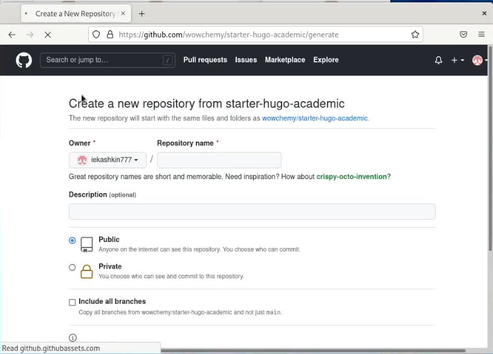
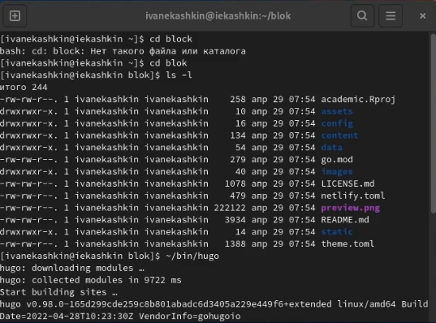
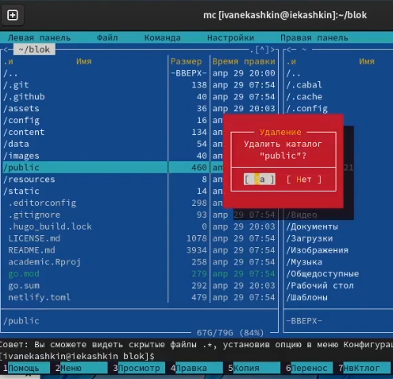
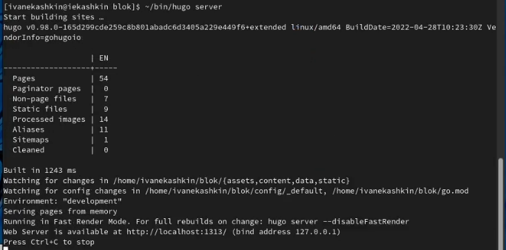
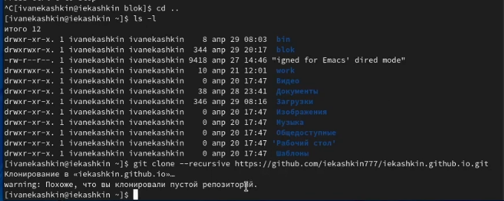
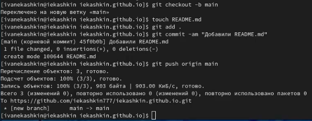
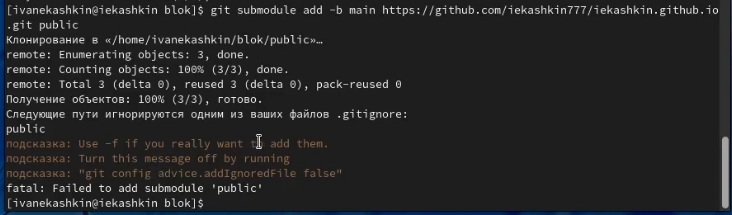
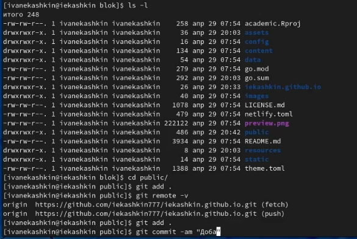

---
## Front matter
title: "Oтчет по 1 этапу индивидуального проекта"
subtitle: "Дисциплина: Операционные системы"
author: "Кашкин Иввн Евгеньевич"

## Generic otions
lang: ru-RU
toc-title: "Содержание"

## Bibliography
bibliography: bib/cite.bib
csl: pandoc/csl/gost-r-7-0-5-2008-numeric.csl

## Pdf output format
toc: true # Table of contents
toc-depth: 2
lof: true # List of figures
lot: true # List of tables
fontsize: 12pt
linestretch: 1.5
papersize: a4
documentclass: scrreprt
## I18n polyglossia
polyglossia-lang:
  name: russian
  options:
	- spelling=modern
	- babelshorthands=true
polyglossia-otherlangs:
  name: english
## I18n babel
babel-lang: russian
babel-otherlangs: english
## Fonts
mainfont: PT Serif
romanfont: PT Serif
sansfont: PT Sans
monofont: PT Mono
mainfontoptions: Ligatures=TeX
romanfontoptions: Ligatures=TeX
sansfontoptions: Ligatures=TeX,Scale=MatchLowercase
monofontoptions: Scale=MatchLowercase,Scale=0.9
## Biblatex
biblatex: true
biblio-style: "gost-numeric"
biblatexoptions:
  - parentracker=true
  - backend=biber
  - hyperref=auto
  - language=auto
  - autolang=other*
  - citestyle=gost-numeric
## Pandoc-crossref LaTeX customization
figureTitle: "Рис."
tableTitle: "Таблица"
listingTitle: "Листинг"
lofTitle: "Список иллюстраций"
lotTitle: "Список таблиц"
lolTitle: "Листинги"
## Misc options
indent: true
header-includes:
  - \usepackage{indentfirst}
  - \usepackage{float} # keep figures where there are in the text
  - \floatplacement{figure}{H} # keep figures where there are in the text
---

# Цель работы

-Размещение на Github pages заготовки для персонального сайта.

# Задание

-Установить необходимое программное обеспечение.
-Скачать шаблон темы сайта.
-Разместить его на хостинге git.
-Установить параметр для URLs сайта.
-Разместить заготовку сайта на Github pages.

# Теоретическое введение

**Статический генератор сайто Hugo**

-Статический генератор сайта — программа, которая из различных исходных файлов (картинок, шаблонов в разных форматах, текстовых файлов и т.п) генерирует статический HTML-сайт. Один из ярких представителей — Hugo. Разработчики позиционируют Hugo, как «самая быстрая в мире платформа для создания сайтов».

# Выполнение лабораторной работы

-1)Скачиваем исполнительный файл hugo. После создаем папку bin и переносим файл туда. Далее в Github создаем новй репозиторий. (рис. [-@fig:001])

{ #fig:001 width=70% }

-2)Далее через терминал переходим в папку нового репозитория и прописываем команду "~/bin/hugo" (рис. [-@fig:002]) 
  
{ #fig:002 width=70% }
  
-3)С помощью команды mc мы удаляем папку public (рис. [-@fig:003]) 

{ #fig:003 width=70% }

-4)Далее прописываем команду "~/bin/hugo server" которая создает нам localhost. Переходим по ссылки и там будет инструкци, которая покажет, как истранить "демо". Нужно удалить файл demo.md(рис. [-@fig:004])

{ #fig:004 width=70% }

-5)Создаем новый репозиторий со своим ником, как в дисплейных классах. После клонируем его на нашу вертуальную машину (рис. [-@fig:005])

{ #fig:0010 width=70% }

-6)Создаем новую ветку main. В ней воздаем файл README.md После выгружаем все это на github.(рис. [-@fig:006])

{ #fig:006 width=70% }

-7)Далее мы возрошаем папку public. Но чтобы все работало коректно, нужно убрать её из "игнора". Надло прокоментировать его в .gitignor, и тогда все будет сгенерироано без ошибок (рис. [-@fig:007])

{ #fig:007 width=70% }

-7)После мы заново прописываем команду "~/bin/hugo", а дальше переходим в папку public и выгружаем через неё все на github. (рис. [-@fig:008])

{ #fig:007 width=70% }

# Выводы

-Научился размещение на Github pages заготовки для персонального сайта.

# Список литературы{.unnumbered}

::: {#https://habr.com/ru/post/532738/}
:::
