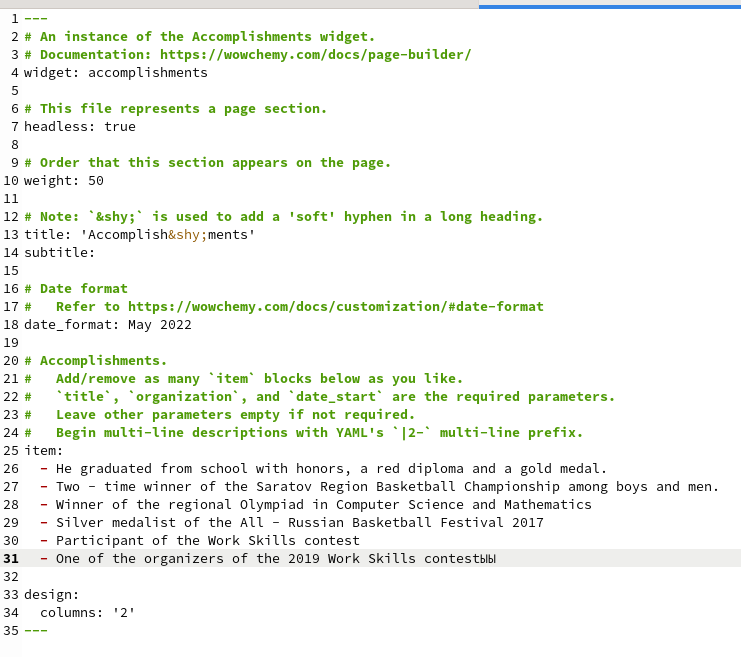
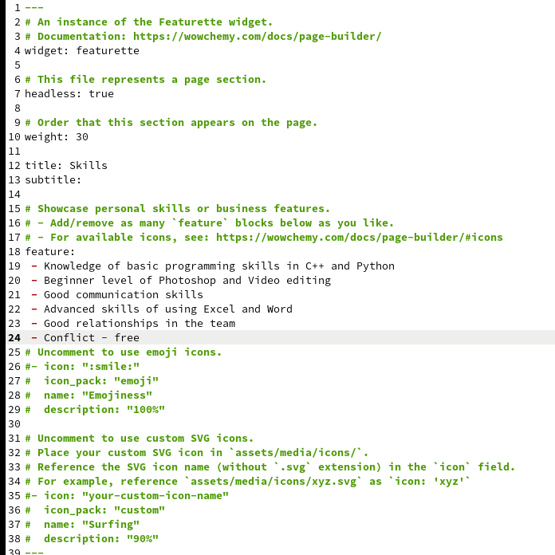
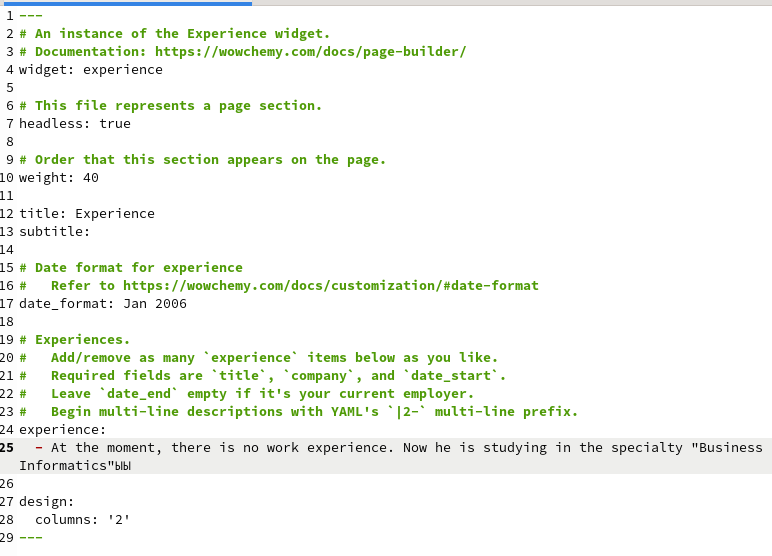
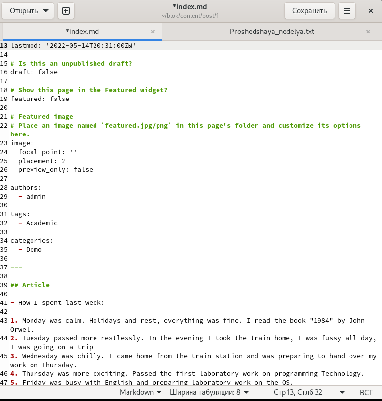
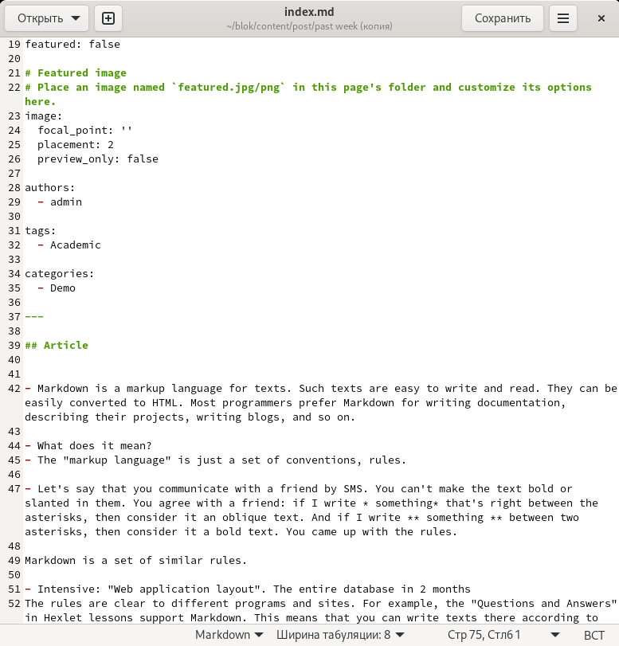

---
## Front matter
lang: ru-RU
title: Отчет по 3 этапу индивидуального проекта
author: Кашкин Иван Евгеньевич
institute: РУДН, Москва, Россия
date: 15 мая 2022 г.

## Formatting
toc: false
slide_level: 2
theme: metropolis
header-includes: 
 - \metroset{progressbar=frametitle,sectionpage=progressbar,numbering=fraction}
 - '\makeatletter'
 - '\beamer@ignorenonframefalse'
 - '\makeatother'
aspectratio: 43
section-titles: true
---

## Цель работы 

Заполнение информации на сайт и написание постов
## Задание

- Добавить к сайту достижения.
- Список достижений.
- Сделать пост по прошедшей неделе.
- Добавить пост на тему по выбору: Язык разметки Markdown.

## Accomplishments

Заполнял информацию о достижениях (Accomplishments)(рис. [-@fig:001])

{ #fig:001 width=70% }

## Skills

Заполнил информацию о навыках (Skills) (рис. [-@fig:002]) 
  
{ #fig:002 width=70% }

С помощью команды mc мы удаляем папку public

## Experience
  
 Заполнил информацию об опыте (Experience) (рис. [-@fig:003]) 

{ #fig:003 width=70% }

## Past week
  
Сделал пост про свою прошлую неделю. (рис. [-@fig:004])

{ #fig:004 width=70% }

## Markdown

 Написал пост о языке разметки Markdown (рис. [-@fig:005])

{ #fig:0010 width=70% }

## Вывод

Научился заполнять информацию на сайте и писать посты

## {.standout}

Спасибо за внимание!
