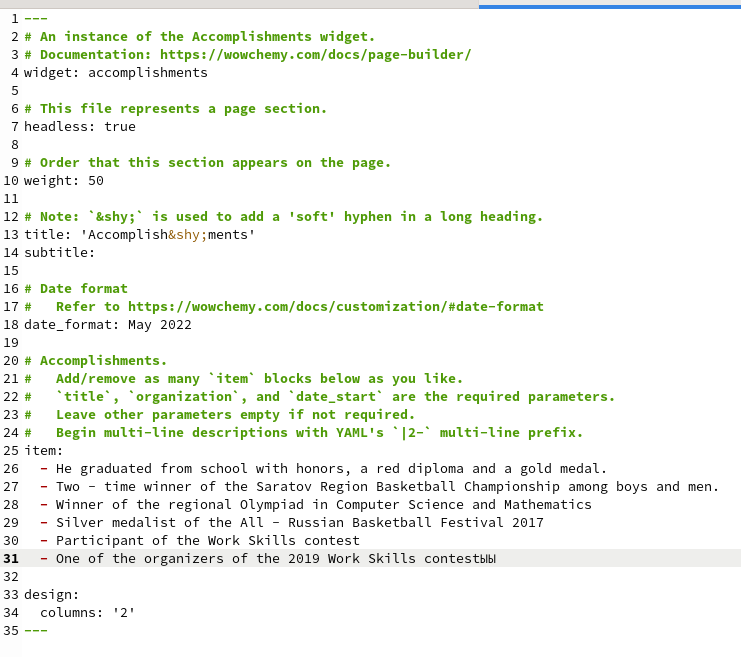
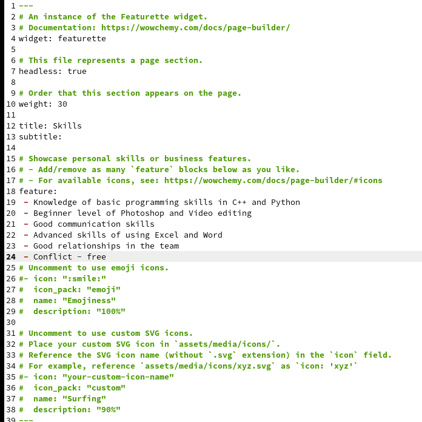
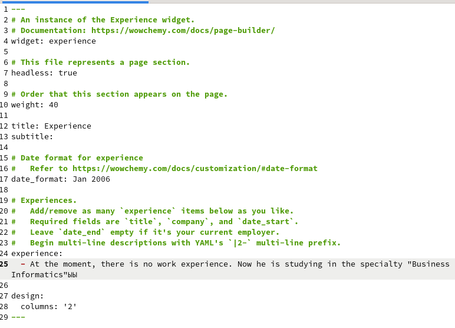
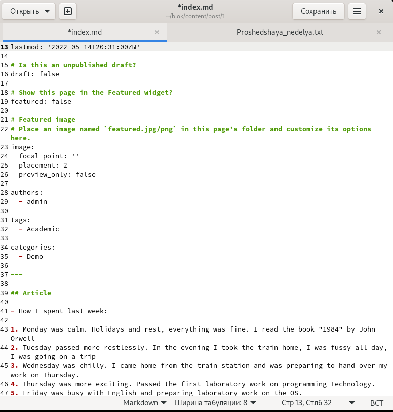
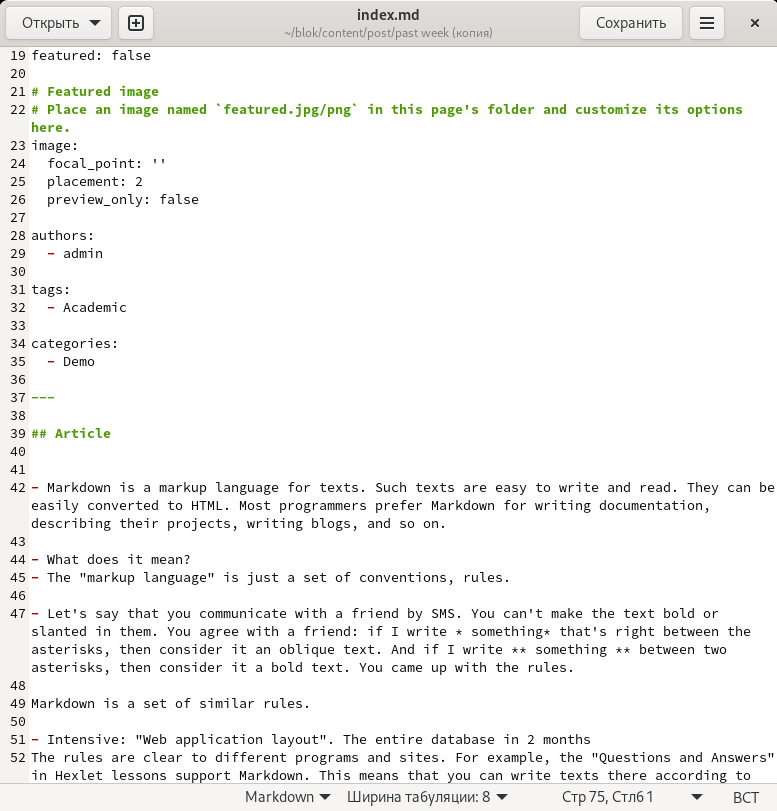

---
## Front matter
title: "Oтчет по 3 этапу индивидуального проекта"
subtitle: "Дисциплина: Операционные системы"
author: "Кашкин Иввн Евгеньевич"

## Generic otions
lang: ru-RU
toc-title: "Содержание"

## Bibliography
bibliography: bib/cite.bib
csl: pandoc/csl/gost-r-7-0-5-2008-numeric.csl

## Pdf output format
toc: true # Table of contents
toc-depth: 2
lof: true # List of figures
lot: true # List of tables
fontsize: 12pt
linestretch: 1.5
papersize: a4
documentclass: scrreprt
## I18n polyglossia
polyglossia-lang:
  name: russian
  options:
	- spelling=modern
	- babelshorthands=true
polyglossia-otherlangs:
  name: english
## I18n babel
babel-lang: russian
babel-otherlangs: english
## Fonts
mainfont: PT Serif
romanfont: PT Serif
sansfont: PT Sans
monofont: PT Mono
mainfontoptions: Ligatures=TeX
romanfontoptions: Ligatures=TeX
sansfontoptions: Ligatures=TeX,Scale=MatchLowercase
monofontoptions: Scale=MatchLowercase,Scale=0.9
## Biblatex
biblatex: true
biblio-style: "gost-numeric"
biblatexoptions:
  - parentracker=true
  - backend=biber
  - hyperref=auto
  - language=auto
  - autolang=other*
  - citestyle=gost-numeric
## Pandoc-crossref LaTeX customization
figureTitle: "Рис."
tableTitle: "Таблица"
listingTitle: "Листинг"
lofTitle: "Список иллюстраций"
lotTitle: "Список таблиц"
lolTitle: "Листинги"
## Misc options
indent: true
header-includes:
  - \usepackage{indentfirst}
  - \usepackage{float} # keep figures where there are in the text
  - \floatplacement{figure}{H} # keep figures where there are in the text
---

# Цель работы

- Заполнение информации на сайт и написание постов.

# Задание

- Добавить к сайту достижения.
- Список достижений.
  1. Добавить информацию о навыках (Skills).
  2. Добавить информацию об опыте (Experience).
  3. Добавить информацию о достижениях (Accomplishments).
- Сделать пост по прошедшей неделе.
- Добавить пост на тему по выбору:
  1. Легковесные языки разметки.
  2. Языки разметки. LaTeX.
  3. Язык разметки Markdown.

# Теоретическое введение

**Статический генератор сайто Hugo**

-Статический генератор сайта — программа, которая из различных исходных файлов (картинок, шаблонов в разных форматах, текстовых файлов и т.п) генерирует статический HTML-сайт. Один из ярких представителей — Hugo. Разработчики позиционируют Hugo, как «самая быстрая в мире платформа для создания сайтов».

# Выполнение лабораторной работы

1. Заполнял информацию о достижениях (Accomplishments)(рис. [-@fig:001])

{ #fig:001 width=70% }

2. Заполнил информацию о навыках (Skills) (рис. [-@fig:002]) 
  
{ #fig:002 width=70% }
  
3. Заполнил информацию об опыте (Experience) (рис. [-@fig:003]) 

{ #fig:003 width=70% }

4. Сделал пост про свою прошлую неделю. (рис. [-@fig:004])

{ #fig:004 width=70% }

5. Написал пост о языке разметки Markdown (рис. [-@fig:005])

{ #fig:0010 width=70% }

# Выводы

- Научился заполнять информацию на сайте и писать посты.

# Список литературы{.unnumbered}

::: {#https://habr.com/ru/post/532738/}
:::
