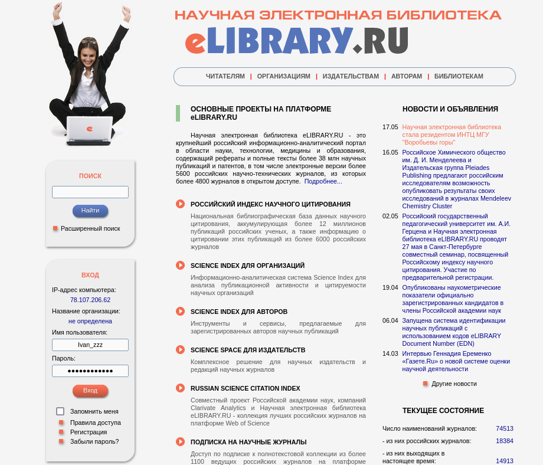
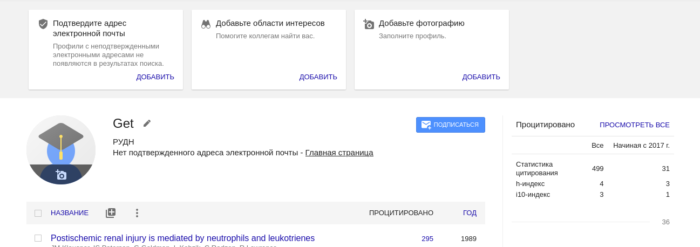
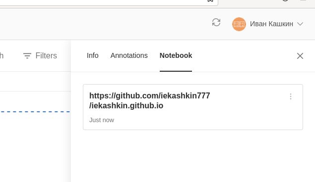
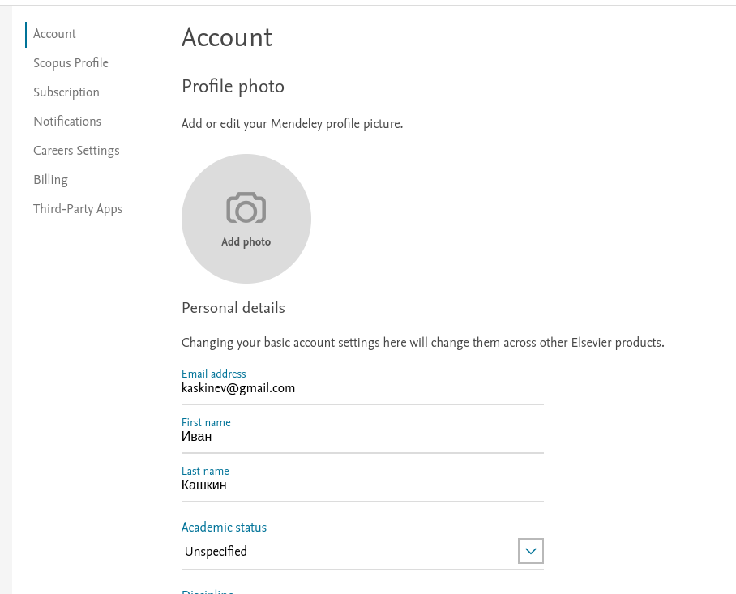
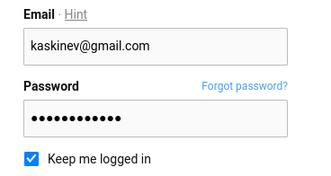
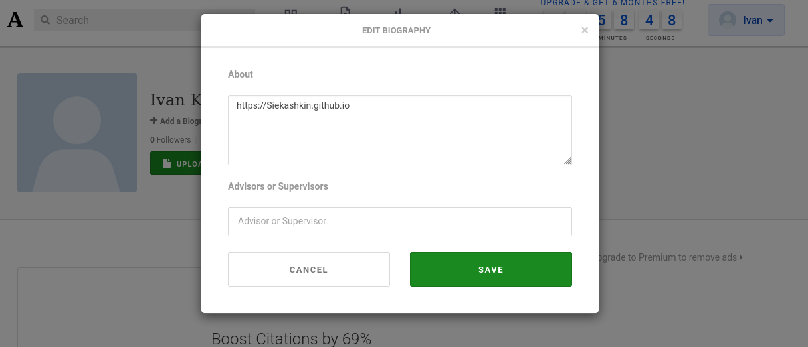
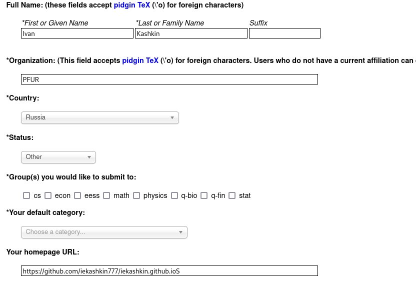

---
## Front matter
lang: ru-RU
title: Отчет по 4 этапу индивидуального проекта
author: Кашкин Иван Евгеньевич
institute: РУДН, Москва, Россия
date: 21 мая 2022 г.

## Formatting
toc: false
slide_level: 2
theme: metropolis
header-includes: 
 - \metroset{progressbar=frametitle,sectionpage=progressbar,numbering=fraction}
 - '\makeatletter'
 - '\beamer@ignorenonframefalse'
 - '\makeatother'
aspectratio: 43
section-titles: true
---

## Цель работы 

Заполнение информации на ресурсах указанных к работе

## Задание

- Добавить к сайту ссылки на научные и библиометрические ресурсы
- Зарегистрироваться на соответствующих ресурсах и разместить на них ссылки на сайте
- Сделать пост по прошедшей неделе
- Добавить пост на тему по выбору

## eLibrary

{ #fig:001 width=70% }

## Google Scholar

{ #fig:002 width=70% }

{ #fig:003 width=70% }

## Mendeley
  
{ #fig:004 width=70% }

## ResearchGate
  
{ #fig:005 width=70% }

## Academia.edu

{ #fig:006 width=70% }

## AarXiv

{ #fig:007 width=70% }

## Last week]

{ #fig:007 width=70% }

## Вывод

Зарегестрировался и опубликовал ссылку на свой сайт на всех ресурсах

## {.standout}

Спасибо за внимание!
