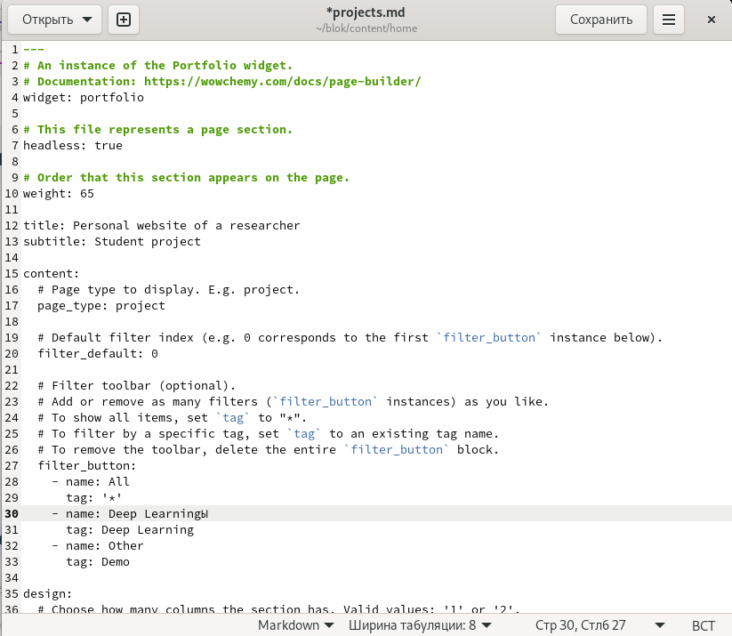
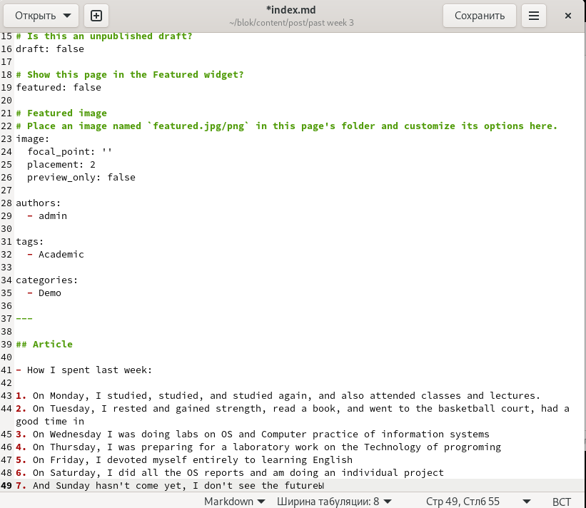
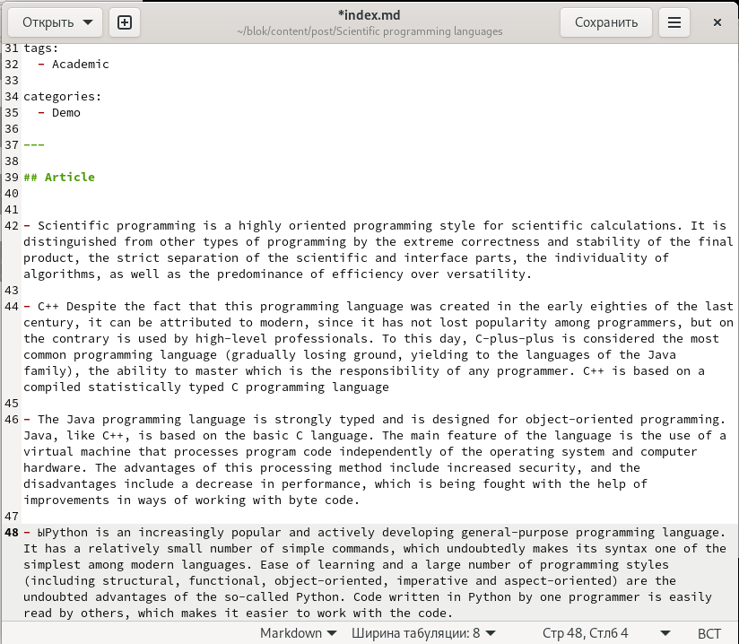

---
## Front matter
lang: ru-RU
title: Отчет по 5 этапу индивидуального проекта
author: Кашкин Иван Евгеньевич
institute: РУДН, Москва, Россия
date: 28 мая 2022 г.

## Formatting
toc: false
slide_level: 2
theme: metropolis
header-includes: 
 - \metroset{progressbar=frametitle,sectionpage=progressbar,numbering=fraction}
 - '\makeatletter'
 - '\beamer@ignorenonframefalse'
 - '\makeatother'
aspectratio: 43
section-titles: true
---

## Цель работы 

Добавить с сайту все остальные элементы

## Задание

- Сделать записи для персональных проектов
- Сделать пост по прошедшей неделе
- Добавить пост на тему по выбору: "Языки научного программирования"

## Персональный проект 

{ #fig:001 width=70% }

## Post about past week

{ #fig:002 width=70% }

## Языки научног программирования 
  
{ #fig:003 width=70% }

## Вывод

Добавил с сайту все остальные элементы

## {.standout}

Спасибо за внимание!
